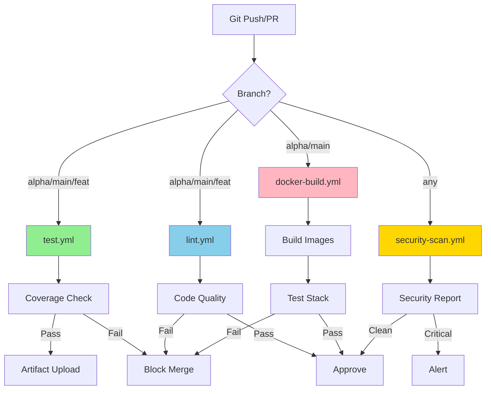

# GitHub Actions Workflows

Comprehensive CI/CD automation for the ApexSigma ecosystem.

## Workflow Overview

### Core Workflows

#### 1. **test.yml** - Comprehensive Test Suite
**Triggers**: Push to alpha/main/feature branches, PRs, manual
**Purpose**: Run full pytest-cov test suite with coverage reporting
**Features**:
- Python 3.13 with Poetry dependency management
- Caching for Poetry and dependencies
- Coverage reporting (XML, HTML, JSON, term)
- 80% coverage threshold enforcement
- Codecov integration
- PR comment with coverage metrics
- Artifact upload for reports

**Usage**:
```bash
# Runs automatically on push/PR
# Manual trigger:
gh workflow run test.yml
```

**Status**: [](https://github.com/{owner}/{repo}/actions/workflows/test.yml)

#### 2. **lint.yml** - Code Quality Checks
**Triggers**: Push to alpha/main/feature branches, PRs, manual
**Purpose**: Enforce code quality and formatting standards
**Features**:
- Ruff linting and formatting checks
- Trunk Check for SAST/lint/format
- Pre-commit hook validation

**Tools**:
- **Ruff**: Fast Python linter and formatter
- **Trunk**: Multi-language code quality platform
- **Pre-commit**: Git hook validation

**Status**: [](https://github.com/{owner}/{repo}/actions/workflows/lint.yml)

#### 3. **docker-build.yml** - Container Build & Test
**Triggers**: Push to alpha/main (with relevant file changes), PRs, manual
**Purpose**: Build, lint, and test Docker containers
**Features**:
- Hadolint Dockerfile linting
- Multi-service matrix build (devenviro.as, InGest-LLM.as, memos.as, tools.as)
- Docker layer caching for faster builds
- Docker Compose stack testing
- Service health check validation
- Smoke tests

**Status**: [](https://github.com/{owner}/{repo}/actions/workflows/docker-build.yml)

#### 4. **security-scan.yml** - Security Scanning
**Triggers**: Push to alpha/main, PRs, daily schedule (2 AM UTC), manual
**Purpose**: Comprehensive security scanning
**Features**:
- **Dependency Scanning**: Safety check for known vulnerabilities
- **Code Scanning**: Bandit for Python security issues
- **Container Scanning**: Trivy for container vulnerabilities
- **Secret Scanning**: Gitleaks for exposed credentials
- SARIF upload to GitHub Security

**Status**: [](https://github.com/{owner}/{repo}/actions/workflows/security-scan.yml)

### Legacy Workflows (To Be Migrated/Retired)

#### 5. **ci.yml** - Original CI Pipeline
**Current State**: Active but basic
**Features**:
- Python 3.13 setup
- Poetry installation and caching
- apexsigma-core and memos.as dependency installation
- Basic pytest execution
- Trunk Flaky Tests upload

**Migration Plan**: Functionality consolidated into `test.yml` and `lint.yml`

#### 6. **pull_request_quality_gate.yml** - PR Quality Gate
**Current State**: Active
**Features**:
- Trunk Check execution
- Unit & integration tests
- Light Docker Compose build

**Migration Plan**: Functionality consolidated into `test.yml`, `lint.yml`, and `docker-build.yml`

#### 7. **github-actions-trunk-setup.yml**
**Current State**: Trunk-specific setup workflow
**Migration Plan**: Integrated into `lint.yml`

#### 8. **scheduled_security_scans.yml**
**Current State**: Scheduled security scanning
**Migration Plan**: Consolidated into `security-scan.yml`

## Workflow Architecture



## Configuration

### Required Secrets

Add these secrets to your GitHub repository:

```yaml
# Repository Settings > Secrets and Variables > Actions

# Optional: Codecov integration
CODECOV_TOKEN: <your-codecov-token>

# Optional: Trunk integration
TRUNK_API_TOKEN: <your-trunk-token>
TRUNK_ORG_URL_SLUG: <your-trunk-org>
```

### Environment Variables

Configured in workflows:
- `PYTHON_VERSION: "3.13"`
- `POETRY_VERSION: "1.8.2"`
- `DOCKER_BUILDKIT: 1`
- `COMPOSE_DOCKER_CLI_BUILD: 1`

## Caching Strategy

### Poetry Dependencies
**Cache Key**: `venv-${{ runner.os }}-${{ env.PYTHON_VERSION }}-${{ hashFiles('**/poetry.lock') }}`
**Location**: `.venv/`
**Benefit**: ~3-5 minute speedup per workflow run

### Docker Layers
**Cache Key**: `${{ runner.os }}-buildx-${{ matrix.service }}-${{ github.sha }}`
**Location**: `/tmp/.buildx-cache`
**Benefit**: ~5-10 minute speedup for Docker builds

## Coverage Requirements

- **Overall Coverage**: 80% minimum (enforced)
- **Unit Tests**: 90% target
- **Integration Tests**: 80% target
- **Critical Paths**: 100% required

## Status Badges

Add these to your README.md:

```markdown


[](https://codecov.io/gh/{owner}/{repo})
```

## Troubleshooting

### Tests Failing in CI but Passing Locally
**Cause**: Environment differences
**Solution**:
1. Check environment variables in workflow
2. Verify Python/Poetry versions match
3. Ensure test data/fixtures are included in git
4. Review CI logs for missing dependencies

### Docker Build Timeout
**Cause**: Layer cache miss or large image
**Solution**:
1. Optimize Dockerfile (multi-stage builds)
2. Ensure cache restore-keys are correct
3. Consider increasing timeout in workflow

### Coverage Below Threshold
**Cause**: New code without tests
**Solution**:
1. Add tests for new functionality
2. Use `# pragma: no cover` for non-testable code (sparingly)
3. Review coverage report in CI artifacts

### Security Scan False Positives
**Cause**: Overly strict rules or known safe issues
**Solution**:
1. Review Bandit/Trivy output
2. Add exclusions to tool configs if justified
3. Update dependencies to patched versions

## Migration Plan (Legacy Workflows)

### Phase 1: Validation (Current)
- ✅ New workflows created and tested
- ✅ Running in parallel with legacy workflows
- ⏳ Monitoring for issues

### Phase 2: Cutover (Next)
- Update branch protection rules to use new workflows
- Archive legacy workflows (rename to `.yml.legacy`)
- Update documentation

### Phase 3: Cleanup (Future)
- Remove legacy workflows after 30 days
- Clean up unused secrets/configs

## Best Practices

1. **Always run locally first**: `pytest`, `ruff check`, `docker-compose build`
2. **Keep workflows fast**: Use caching, parallel jobs, matrix builds
3. **Fail fast**: Put critical checks early in workflow
4. **Clear failure messages**: Ensure errors are actionable
5. **Secure secrets**: Never log secrets, use GitHub Secrets
6. **Document changes**: Update this README when modifying workflows

## Local Testing

Test workflow changes locally with [act](https://github.com/nektos/act):

```bash
# Install act
brew install act  # macOS
choco install act  # Windows

# Run test workflow
act -j test

# Run specific workflow
act -W .github/workflows/test.yml

# Run with secrets
act -s CODECOV_TOKEN=<token>
```

## Monitoring & Metrics

### Workflow Success Rate
**Target**: >95% success rate on `alpha` branch
**Monitor**: GitHub Actions dashboard

### Average Run Time
**Target**: 
- test.yml: <10 minutes
- lint.yml: <5 minutes
- docker-build.yml: <15 minutes
- security-scan.yml: <20 minutes

### Cache Hit Rate
**Target**: >80% cache hit rate
**Monitor**: CI logs for "Cache hit" messages

## Support

For questions or issues:
1. Check this documentation
2. Review CI logs in GitHub Actions
3. Check ApexSigma Agent Roster (AGENTS.md)
4. Create GitHub issue with CI logs

## Related Documentation

- [ApexSigma Testing Guide](../../docs/testing-guide.md)
- [Docker Compose Configuration](../../docker-compose.unified.yml)
- [pytest-cov Documentation](../../tests/README.md)
- [AGENTS.md](../../AGENTS.md) - Agent roster and protocols
