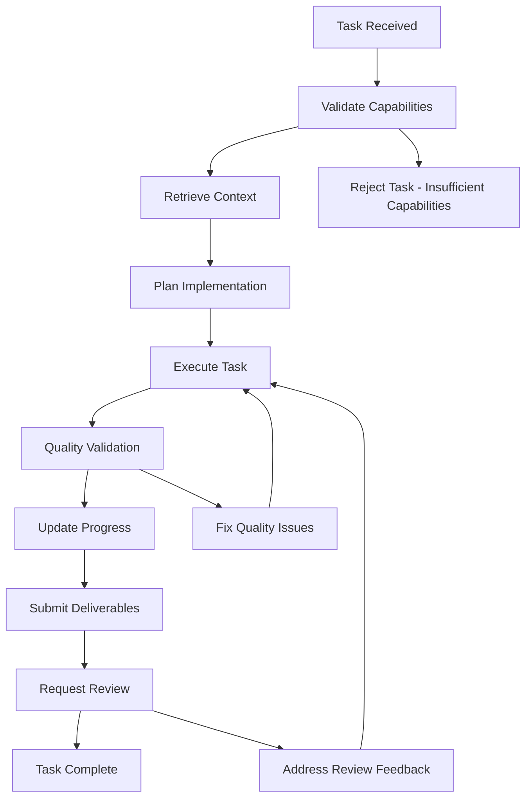

# 🤖 Agent Operational Context - ApexSigma Society of Agents

**Authority**: Omega Ingest Immutable Laws  
**Classification**: Tier 3 Specialized Agent Protocol  
**Effective Date**: September 1, 2025  
**Scope**: All DevEnviro orchestrated agents within ApexSigma ecosystem

---

## 🔧 **MANDATORY AGENT INITIALIZATION PROTOCOL**

### **BEFORE ANY SPECIALIZED AGENT ACTIVITIES:**

1. **Agent Registry Validation**:
   ```bash
   # Step 1: Verify agent registration status
   GET http://172.26.0.11:8090/agents/{agent_id}/status
   
   # Step 2: Retrieve agent capabilities and permissions
   GET http://172.26.0.11:8090/agents/{agent_id}/capabilities
   
   # Step 3: Initialize communication channel
   POST http://172.26.0.11:8090/agents/{agent_id}/initialize
   ```

2. **Context Retrieval Sequence**:
   ```bash
   # Step 1: Query InGest-LLM for domain-specific context
   POST http://172.26.0.12:8000/query_context
   {
     "query": "domain knowledge for [agent_persona]",
     "agent_id": "{agent_id}",
     "domain": "[backend|frontend|devops|qa|security|etc]"
   }
   
   # Step 2: Query memOS for historical agent actions
   POST http://172.26.0.13:8090/memory/query
   {
     "query": "previous agent actions and outcomes",
     "agent_filter": "{agent_id}",
     "memory_type": "agent_history"
   }
   ```

3. **Task Assignment Validation**:
   - Confirm task aligns with agent capabilities
   - Verify required permissions and access levels
   - Check for conflicting tasks or dependencies
   - Validate resource availability and constraints

---

## 🎭 **SPECIALIZED AGENT PERSONAS**

### **Backend Specialist Agent**
**ID**: `backend-specialist`  
**Capabilities**: API development, database design, server architecture  
**Authority Level**: Tier 2 - Can modify backend services with review  
**Communication**: RabbitMQ queue `backend.tasks`

**Operational Focus**:
```python
# Example Task Patterns
- FastAPI endpoint development
- SQLAlchemy model creation
- Database migration scripting
- API integration implementation
- Performance optimization
- Error handling and logging
```

### **Frontend Specialist Agent**  
**ID**: `frontend-specialist`  
**Capabilities**: UI/UX implementation, component development, responsive design  
**Authority Level**: Tier 3 - Frontend modifications with standard review  
**Communication**: RabbitMQ queue `frontend.tasks`

**Operational Focus**:
```javascript
// Example Task Patterns
- React/Vue component development
- CSS/Styling implementation
- User interface optimization
- Accessibility implementation  
- Frontend performance tuning
- Cross-browser compatibility
```

### **DevOps Engineer Agent**
**ID**: `devops-engineer`  
**Capabilities**: CI/CD, infrastructure, deployment, monitoring  
**Authority Level**: Tier 1 - Infrastructure changes require dual verification  
**Communication**: RabbitMQ queue `devops.tasks`

**Operational Focus**:
```yaml
# Example Task Patterns
- Docker container optimization
- CI/CD pipeline development
- Infrastructure automation
- Monitoring and alerting setup
- Performance monitoring
- Security hardening
```

### **QA Engineer Agent**
**ID**: `qa-engineer`  
**Capabilities**: Test strategy, automation, quality validation  
**Authority Level**: Tier 2 - Quality gate decisions  
**Communication**: RabbitMQ queue `qa.tasks`

**Operational Focus**:
```python
# Example Task Patterns  
- Test suite development
- Quality gate validation
- Performance testing
- Security testing
- Integration testing
- Test automation frameworks
```

### **Security Engineer Agent**
**ID**: `security-engineer`  
**Capabilities**: Security architecture, vulnerability assessment, compliance  
**Authority Level**: Tier 1 - Security decisions require verification  
**Communication**: RabbitMQ queue `security.tasks`

**Operational Focus**:
```bash
# Example Task Patterns
- Security architecture review
- Vulnerability assessments
- Authentication implementation
- Authorization frameworks
- Security monitoring
- Compliance validation
```

### **Software Architect Agent**
**ID**: `software-architect`  
**Capabilities**: System design, technical standards, architectural decisions  
**Authority Level**: Tier 1 - Architecture decisions require verification  
**Communication**: RabbitMQ queue `architect.tasks`

**Operational Focus**:
```markdown
# Example Task Patterns
- System architecture design
- Technical standards definition
- Design pattern implementation
- Technology stack decisions
- Integration architecture
- Scalability planning
```

### **Additional Specialized Agents**
- **Product Owner Agent**: Requirements, user stories, MVP definition
- **Project Manager Agent**: Timeline, resources, coordination
- **Engineering Manager Agent**: Team processes, performance, velocity
- **Enterprise CTO Agent**: Strategy, governance, enterprise decisions
- **Technical Writer Agent**: Documentation, API specs, user guides
- **Senior Fullstack Developer Agent**: Complex implementations, mentoring

---

## 📋 **AGENT COMMUNICATION PROTOCOLS**

### **RabbitMQ Message Structure**
```json
{
  "task_id": "uuid-v4-string",
  "agent_id": "backend-specialist",
  "agent_type": "specialized",
  "priority": "high|medium|low",
  "task_type": "implementation|review|analysis|documentation",
  "payload": {
    "description": "Task description",
    "requirements": ["requirement1", "requirement2"],
    "context": {
      "project": "devenviro.as|memos.as|InGest-LLM.as|tools.as",
      "files": ["file1.py", "file2.py"],
      "dependencies": ["service1", "service2"]
    },
    "success_criteria": ["criteria1", "criteria2"],
    "deadline": "ISO-8601-timestamp"
  },
  "metadata": {
    "created_by": "orchestrator",
    "created_at": "ISO-8601-timestamp",
    "estimated_duration": "PT30M",
    "complexity": "low|medium|high|critical"
  }
}
```

### **Agent Response Structure**
```json
{
  "task_id": "uuid-v4-string",
  "agent_id": "backend-specialist", 
  "status": "completed|in_progress|blocked|failed",
  "progress": 0.85,
  "result": {
    "summary": "Task completion summary",
    "deliverables": [
      {
        "type": "code|documentation|analysis",
        "location": "file_path_or_url",
        "description": "Deliverable description"
      }
    ],
    "metrics": {
      "duration": "PT25M",
      "quality_score": 0.92,
      "test_coverage": 0.87
    }
  },
  "next_actions": ["action1", "action2"],
  "blockers": [],
  "completed_at": "ISO-8601-timestamp"
}
```

---

## 🔄 **TASK EXECUTION WORKFLOW**

### **Standard Agent Task Flow**


### **Agent Implementation Pattern**
```python
# Standard Agent Implementation Template
class SpecializedAgent:
    def __init__(self, agent_id: str, capabilities: List[str]):
        self.agent_id = agent_id
        self.capabilities = capabilities
        self.context_service = get_context_service()
        self.memory_service = get_memory_service()
        self.communication = get_rabbitmq_client()
        
    async def process_task(self, task: AgentTask) -> AgentResponse:
        # 1. Validate task against capabilities
        if not self.can_handle_task(task):
            return self.reject_task(task, "Insufficient capabilities")
            
        # 2. Retrieve context
        context = await self.retrieve_context(task)
        
        # 3. Plan and execute
        try:
            result = await self.execute_task(task, context)
            
            # 4. Quality validation
            if not self.validate_quality(result):
                return self.request_revision(task, result)
                
            # 5. Store results and request review
            await self.store_results(result)
            return self.submit_for_review(task, result)
            
        except Exception as e:
            return self.handle_error(task, e)
            
    async def retrieve_context(self, task: AgentTask) -> AgentContext:
        # Query InGest-LLM and memOS for relevant context
        pass
        
    async def execute_task(self, task: AgentTask, context: AgentContext):
        # Domain-specific implementation
        pass
        
    def validate_quality(self, result: TaskResult) -> bool:
        # Agent-specific quality validation
        pass
```

---

## 📊 **AGENT PERFORMANCE STANDARDS**

### **Operational Metrics**
```python
# Agent Performance Tracking
class AgentMetrics:
    task_completion_rate: float       # >95% target
    average_response_time: timedelta  # <1 hour target
    quality_score: float              # >90% target
    peer_review_score: float          # >85% target
    context_utilization: float        # >80% target
    error_rate: float                 # <5% target
```

### **Quality Standards by Agent Type**

#### **Backend Specialist Standards**
- **Code Quality**: Ruff linting 100%, mypy type coverage >90%
- **Performance**: API endpoints <100ms, database queries optimized
- **Testing**: >80% code coverage, integration tests required
- **Documentation**: All public APIs documented with examples
- **Security**: No credential exposure, proper input validation

#### **Frontend Specialist Standards**  
- **UI/UX**: Responsive design, accessibility compliance (WCAG 2.1)
- **Performance**: Lighthouse score >90, Core Web Vitals optimized
- **Testing**: Component tests, e2e tests for critical paths
- **Browser Support**: Cross-browser compatibility (Chrome, Firefox, Safari, Edge)
- **Code Quality**: ESLint compliance, TypeScript where applicable

#### **DevOps Engineer Standards**
- **Infrastructure**: Container health checks, resource limits defined
- **Automation**: All deployments automated, rollback procedures tested
- **Monitoring**: Comprehensive metrics and alerting implemented
- **Security**: Security scanning integrated, secrets management
- **Documentation**: Runbooks and operational procedures documented

#### **QA Engineer Standards**
- **Test Coverage**: >80% line coverage, >95% critical path coverage
- **Test Quality**: Edge cases covered, error conditions tested
- **Performance**: Test execution <5 minutes, performance benchmarks validated
- **Security**: Security testing integrated, vulnerability scanning
- **Automation**: CI/CD integration, automated quality gates

---

## 🤝 **MAR PROTOCOL FOR AGENTS**

### **Mandatory Agent Review Participation**
All specialized agents participate in MAR processes according to their authority level:

#### **Tier 1 Agents** (Architecture, DevOps, Security)
- **Review Authority**: Can approve/reject Tier 2 and Tier 3 submissions
- **Submission Requirement**: All changes require dual agent verification
- **Review Focus**: Architecture alignment, security implications, infrastructure impact

#### **Tier 2 Agents** (Backend, QA, Project Management)  
- **Review Authority**: Can approve Tier 3 submissions
- **Submission Requirement**: Changes require single peer agent review
- **Review Focus**: Implementation quality, testing coverage, functional requirements

#### **Tier 3 Agents** (Frontend, Technical Writing, Product Owner)
- **Review Authority**: Provide feedback and recommendations
- **Submission Requirement**: Self-review with documentation
- **Review Focus**: User experience, documentation quality, requirement alignment

### **Agent Review Process**
```python
# MAR Review Implementation
class AgentReviewProcess:
    async def submit_for_review(self, deliverable: AgentDeliverable) -> ReviewRequest:
        review_request = ReviewRequest(
            agent_id=self.agent_id,
            deliverable=deliverable,
            required_reviewers=self.determine_required_reviewers(deliverable),
            review_criteria=self.get_review_criteria(deliverable)
        )
        
        return await self.mar_service.submit_review(review_request)
        
    async def conduct_review(self, review_request: ReviewRequest) -> ReviewResponse:
        # Agent-specific review implementation
        analysis = await self.analyze_deliverable(review_request.deliverable)
        
        return ReviewResponse(
            reviewer_id=self.agent_id,
            approval_status="approved|rejected|needs_revision",
            feedback=analysis.feedback,
            quality_score=analysis.quality_score,
            recommendations=analysis.recommendations
        )
```

---

## 🛡️ **AGENT SECURITY PROTOCOLS**

### **Agent Authentication & Authorization**
```python
# Agent Security Implementation
class AgentSecurityContext:
    def __init__(self, agent_id: str, agent_token: str):
        self.agent_id = agent_id
        self.agent_token = agent_token
        self.permissions = self.load_permissions()
        self.security_level = self.determine_security_level()
        
    def can_access_resource(self, resource: str, action: str) -> bool:
        return self.permissions.allows(resource, action)
        
    def can_modify_service(self, service: str) -> bool:
        return service in self.permissions.modifiable_services
        
    def requires_dual_verification(self, operation: str) -> bool:
        return operation in self.permissions.dual_verification_required
```

### **Data Protection for Agents**
- **Multi-tenant Isolation**: Agents can only access data they own or are authorized for
- **Credential Management**: No hardcoded credentials, secure token-based authentication  
- **Audit Logging**: All agent actions logged with full context
- **Resource Limits**: CPU, memory, and time limits enforced
- **Network Isolation**: Agents operate within defined network boundaries

---

## 📚 **AGENT DEVELOPMENT RESOURCES**

### **Agent SDK and Libraries**
```python
# Agent Development Kit
from apexsigma_agent_sdk import (
    AgentBase,
    ContextService,
    MemoryService, 
    CommunicationService,
    QualityValidator,
    SecurityContext
)

# Agent Implementation Template
class CustomAgent(AgentBase):
    def __init__(self):
        super().__init__()
        self.domain = "custom_domain"
        self.capabilities = ["capability1", "capability2"]
        
    async def handle_task(self, task: AgentTask) -> AgentResponse:
        # Custom agent implementation
        pass
```

### **Testing Framework for Agents**
```python
# Agent Testing Framework
import pytest
from apexsigma_agent_testing import AgentTestSuite, MockServices

class TestCustomAgent(AgentTestSuite):
    @pytest.fixture
    def agent(self):
        return CustomAgent()
        
    @pytest.fixture  
    def mock_services(self):
        return MockServices()
        
    async def test_agent_task_processing(self, agent, mock_services):
        task = self.create_mock_task("test_task")
        response = await agent.process_task(task)
        
        assert response.status == "completed"
        assert response.quality_score > 0.8
```

---

## ✅ **AGENT OPERATIONAL CHECKLIST**

### **Agent Initialization**
- [ ] Agent registered in DevEnviro agent registry
- [ ] RabbitMQ communication channel established
- [ ] Context retrieval services configured
- [ ] Security context and permissions validated
- [ ] Performance monitoring enabled

### **Task Processing**
- [ ] Task capabilities validated against agent persona
- [ ] Context retrieved from InGest-LLM and memOS
- [ ] Implementation follows domain-specific standards
- [ ] Quality validation performed before submission
- [ ] Results stored in appropriate systems

### **Quality Assurance**
- [ ] Code quality standards met (linting, typing, testing)
- [ ] Performance benchmarks satisfied
- [ ] Security requirements validated
- [ ] Documentation complete and accurate
- [ ] MAR review process completed if required

### **Operational Monitoring**
- [ ] Performance metrics within acceptable ranges
- [ ] Error rates below thresholds
- [ ] Resource usage monitored and optimized
- [ ] Communication channels healthy
- [ ] Security posture maintained

---

## 🚀 **OPERATION ASGARD REBIRTH AGENT FOCUS**

**Primary Agent Objectives**:
1. **Service Implementation**: Complete missing functionality across all 4 services
2. **Integration Testing**: Validate cross-service communication and workflows
3. **Quality Assurance**: Achieve 90+ health scores for all services
4. **Documentation**: Comprehensive documentation and operational procedures

**Agent-Specific Success Metrics**:
- **Backend Specialist**: All API endpoints operational, database schemas complete
- **DevOps Engineer**: Full CI/CD pipeline, monitoring stack operational  
- **QA Engineer**: 100% critical path test coverage, performance validated
- **Security Engineer**: Zero high-severity vulnerabilities, security hardening complete

---

*This document establishes operational standards for all specialized agents within the ApexSigma Society of Agents ecosystem. All agents must follow these protocols to ensure coordinated, high-quality development outcomes.*

**Last Updated**: September 1, 2025  
**Authority**: Omega Ingest Immutable Laws  
**Verification Status**: DUAL VERIFIED ✅