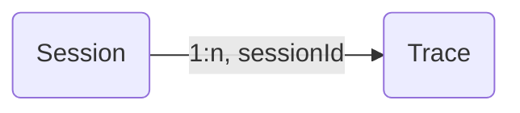

pip install langfuse

LANGFUSE_SECRET_KEY = "sk-lf-..."
LANGFUSE_PUBLIC_KEY = "pk-lf-..."
LANGFUSE_HOST = "https://cloud.langfuse.com" # 🇪🇺 EU region
# LANGFUSE_HOST = "https://us.cloud.langfuse.com" # 🇺🇸 US region

from langfuse import observe, get_client
 
@observe
def my_function():
    return "Hello, world!" # Input/output and timings are automatically captured
 
my_function()
 
# Flush events in short-lived applications
langfuse = get_client()
langfuse.flush()


from langfuse import get_client
 
langfuse = get_client()
 
# Create a span using a context manager
with langfuse.start_as_current_span(name="process-request") as span:
    # Your processing logic here
    span.update(output="Processing complete")
 
    # Create a nested generation for an LLM call
    with langfuse.start_as_current_generation(name="llm-response", model="gpt-3.5-turbo") as generation:
        # Your LLM call logic here
        generation.update(output="Generated response")
 
# All spans are automatically closed when exiting their context blocks
 
 
# Flush events in short-lived applications
langfuse.flush()


from langfuse import get_client
 
langfuse = get_client()
 
# Create a span without a context manager
span = langfuse.start_span(name="user-request")
 
# Your processing logic here
span.update(output="Request processed")
 
# Child spans must be created using the parent span object
nested_span = span.start_span(name="nested-span")
nested_span.update(output="Nested span output")
 
# Important: Manually end the span
nested_span.end()
 
# Important: Manually end the parent span
span.end()
 
# Flush events in short-lived applications
langfuse.flush()


API Keys
Secret Key
This key can only be viewed once. You can always create new keys in the project settings.

sk-lf-ad7e9785-fb81-4340-aa6a-4cc265aec073
Public Key

pk-lf-bba97616-6c46-4d0d-b3a1-2b3cb9e03ee5
Host

https://cloud.langfuse.com
Usage
Python
JS/TS
OpenAI
Langchain
Langchain JS
Other

pip install langfuse

from langfuse import Langfuse

langfuse = Langfuse(
  secret_key="sk-lf-ad7e9785-fb81-4340-aa6a-4cc265aec073",
  public_key="pk-lf-bba97616-6c46-4d0d-b3a1-2b3cb9e03ee5",
  host="https://cloud.langfuse.com"
)
See Quickstart and Python docs for more details and an end-to-end example.

Do you have questions or issues? Check out this FAQ post for common resolutions, Ask AI or get support.API Keys
Secret Key
This key can only be viewed once. You can always create new keys in the project settings.

sk-lf-ad7e9785-fb81-4340-aa6a-4cc265aec073
Public Key

pk-lf-bba97616-6c46-4d0d-b3a1-2b3cb9e03ee5
Host

https://cloud.langfuse.com
Usage
Python
JS/TS
OpenAI
Langchain
Langchain JS
Other

pip install langfuse

from langfuse import Langfuse

langfuse = Langfuse(
  secret_key="sk-lf-ad7e9785-fb81-4340-aa6a-4cc265aec073",
  public_key="pk-lf-bba97616-6c46-4d0d-b3a1-2b3cb9e03ee5",
  host="https://cloud.langfuse.com"
)
See Quickstart and Python docs for more details and an end-to-end example.

Do you have questions or issues? Check out this FAQ post for common resolutions, Ask AI or get support.


---
title: Sessions (Chats, Threads, etc.)
description: Track LLM chat conversations or threads across multiple traces in a single session. Replay the entire interaction to debug or analyze the conversation.
sidebarTitle: Sessions
---

# Sessions

Many interactions with LLM applications span multiple traces. `Sessions` in Langfuse are a way to group these traces together and see a simple **session replay** of the entire interaction. Get started by adding a `sessionId` when creating a trace.



Add a `sessionId` when creating/updating a trace. This can be any string that you use to identify the session. All traces with the same `sessionId` will be grouped together.

<Tabs items={["Python SDK", "JS/TS", "OpenAI (Python)", "Langchain (Python)", "Langchain (JS/TS)", "Flowise"]}>

<Tab title="Python SDK (v3)">
When using the `@observe()` decorator:

```python
from langfuse import observe, get_client

@observe()
def process_request():
    # Get the client
    langfuse = get_client()

    # Add to the current trace
    langfuse.update_current_trace(session_id="your-session-id")

    # ...your processing logic...
    return result
```

When creating spans directly:

```python
from langfuse import get_client

langfuse = get_client()

# You can set the session_id when creating the root span
with langfuse.start_as_current_span(
    name="process-chat-message"
) as root_span:
    # Add session_id to the trace
    root_span.update_trace(session_id="chat-session-123")

    # All spans in this trace will belong to the same session
    with root_span.start_as_current_generation(
        name="generate-response",
        model="gpt-4o"
    ) as gen:
        # ...generate response...
        pass
```

You can also update the session_id of the current trace without a direct reference to a span:

```python
with langfuse.start_as_current_span(name="another-operation"):
    # Add to the current trace
    langfuse.update_current_trace(session_id="your-session-id")
```

</Tab>
<Tab title="JS/TS SDK">

When using the context manager:

```ts
import {
  startActiveObservation,
  startObservation,
  updateActiveTrace,
} from "@langfuse/tracing";

await startActiveObservation("context-manager", async (span) => {
  span.update({
    input: { query: "What is the capital of France?" },
  });

  // set sessionId on the trace
  updateActiveTrace({
    sessionId: "session-123",
  });
});
```

When using the `observe` wrapper:

```ts
import { observe, updateActiveTrace } from "@langfuse/tracing";

// An existing function
async function fetchData(source: string) {
  // set sessionId on the trace
  updateActiveTrace({
    sessionId: "session-123",
  });

  // ... logic to fetch data
  return { data: `some data from ${source}` };
}

// Wrap the function to trace it
const tracedFetchData = observe(fetchData, {
  name: "observe-wrapper",
});

const result = await tracedFetchData("API");
```

When creating spans manually:

```ts
import { startObservation } from "@langfuse/tracing";

const span = startObservation("manual-observation", {
  input: { query: "What is the capital of France?" },
});

// set sessionId on the trace
span.updateTrace({
  sessionId: "session-123",
});

span.update({ output: "Paris" }).end();
```

See [JS/TS SDK docs](/docs/sdk/typescript/guide) for more details.

</Tab>
<Tab>

```python
from langfuse.openai import openai

completion = openai.chat.completions.create(
  name="test-chat",
  model="gpt-3.5-turbo",
  messages=[
    {"role": "system", "content": "You are a calculator."},
    {"role": "user", "content": "1 + 1 = "}],
  temperature=0,
  metadata={"langfuse_session_id": "your-session-id"}
)
```

</Tab>
<Tab>

```python
from langfuse.langchain import CallbackHandler

handler = CallbackHandler()

# Pass langfuse_session_id as metadata to the chain invocation
chain.invoke(
    {"animal": "dog"},
    config={
        "callbacks": [handler],
        "metadata": {
            "langfuse_session_id": "your-session-id",
        },
    },
)
```

</Tab>
<Tab title="Langchain (JS/TS)">

When using the [CallbackHandler](/integrations/frameworks/langchain), you can pass the `sessionId` to the constructor:

```ts
const handler = new CallbackHandler({
  sessionId: "your-session-id",
});
```

You can also set the `session_id` dynamically via the runnable configuration in the chain invocation:

```ts
import { CallbackHandler } from "langfuse-langchain";

const langfuseHandler = new CallbackHandler();

// Your existing Langchain code to create the chain
...

// Pass langfuseSessionId as metadata to the chain invocation to be parsed as the Langfuse session_id
await chain.invoke(
  { input: "<user_input>" },
  { callbacks: [langfuseHandler], metadata: { langfuseSessionId: "your-session-id" } }
);
```

When using the integration with the JS SDK (see [interop docs](/integrations/frameworks/langchain#interoperability)), set the sessionId via `langfuse.trace()`:

```ts
import { CallbackHandler, Langfuse } from "langfuse-langchain";
const langfuse = new Langfuse();

const trace = langfuse.trace({
  sessionId: "your-session-id",
});
const langfuseHandler = new CallbackHandler({ root: trace });

// Add Langfuse handler as callback to your langchain chain/agent
await chain.invoke({ input: "<user_input>" }, { callbacks: [langfuseHandler] });
```

</Tab>

<Tab title="Flowise">
The [Flowise Integration](/docs/flowise) automatically maps the Flowise chatId to the Langfuse sessionId. Flowise 1.4.10 or higher is required.

</Tab>

</Tabs>

## Example

Try this feature using the public [example project](/docs/demo).

_Example session spanning multiple traces_

<Frame border fullWidth>
  
</Frame>

## Other features

- Publish a session to share with others as a public link ([example](https://cloud.langfuse.com/project/clkpwwm0m000gmm094odg11gi/sessions/lf.docs.conversation.TL4KDlo))
- Bookmark a session to easily find it later
- Annotate sessions by adding `scores` via the Langfuse UI to record human-in-the-loop evaluations

## GitHub Discussions

import { GhDiscussionsPreview } from "@/components/gh-discussions/GhDiscussionsPreview";

<GhDiscussionsPreview labels={["feat-sessions"]} />


---
description: User-level LLM observability to track token usage, usage volume and individual user feedback.
sidebarTitle: User Tracking
---

# User Tracking

The Users view provides an overview of all users. It also offers an in-depth look into individual users.

<CloudflareVideo
  videoId="1c8ab99f53799bcb24ce11982065a7d9"
  aspectRatio={1696 / 1080}
  gifStyle
/>

It's easy to map data in Langfuse to individual users. Just pass a unique identifier as the `userId` when you create a `trace`. This can be a username, email, or any other unique identifier. The `userId` is optional, but using it helps you get more from Langfuse. See the integration docs to learn more.

<Tabs items={["Python SDK", "JS/TS", "OpenAI (Python)", "Langchain (Python)", "Langchain (JS/TS)", "Flowise"]}>
<Tab>
When using the `@observe()` decorator:

```python
from langfuse import observe, get_client

langfuse = get_client()

@observe()
def process_user_request(user_query):
    # Add user_id to the current trace
    langfuse.update_current_trace(user_id="user_12345")

    # ...your processing logic...
    return result
```

When creating spans directly:

```python
from langfuse import get_client

langfuse = get_client()

# You can set the user_id when creating the root span via update_trace
with langfuse.start_as_current_span(
    name="process-user-request"
) as root_span:
    # Add user_id to the trace
    root_span.update_trace(user_id="user_12345")

    # All spans in this trace will be associated with this user
    with root_span.start_as_current_generation(
        name="generate-response",
        model="gpt-4o"
    ) as gen:
        # ...generate response...
        pass
```

You can also update the user_id of the current trace without a direct reference to a span:

```python
with langfuse.start_as_current_span(name="handle-user-interaction"):
    # Add user_id to the current trace
    langfuse.update_current_trace(user_id="user_12345")
```

</Tab>
<Tab title="JS/TS SDK">

When using the context manager:

```ts
import {
  startActiveObservation,
  startObservation,
  updateActiveTrace,
} from "@langfuse/tracing";

await startActiveObservation("context-manager", async (span) => {
  span.update({
    input: { query: "What is the capital of France?" },
  });

  updateActiveTrace({
    userId: "user-123",
  });
});
```

When using the `observe` wrapper:

```ts
import { observe, updateActiveTrace } from "@langfuse/tracing";

// An existing function
async function fetchData(source: string) {
  updateActiveTrace({
    userId: "user-123",
  });

  // ... logic to fetch data
  return { data: `some data from ${source}` };
}

// Wrap the function to trace it
const tracedFetchData = observe(fetchData, {
  name: "observe-wrapper",
});

const result = await tracedFetchData("API");
```

When creating spans manually:

```ts
import { startObservation } from "@langfuse/tracing";

const span = startObservation("manual-observation", {
  input: { query: "What is the capital of France?" },
});

span.updateTrace({
  userId: "user-123",
});

span.update({ output: "Paris" }).end();
```

See [JS/TS SDK docs](/docs/sdk/typescript/guide) for more details.

</Tab>
<Tab>

```python
from langfuse.openai import openai

completion = openai.chat.completions.create(
  name="test-chat",
  model="gpt-3.5-turbo",
  messages=[
    {"role": "system", "content": "You are a calculator."},
    {"role": "user", "content": "1 + 1 = "}],
  temperature=0,
  metadata={"langfuse_user_id": "user-id"}
)
```

</Tab>
<Tab title="OpenAI (Python)">

Use metadata in chain invocation:

```python
from langfuse.langchain import CallbackHandler

handler = CallbackHandler()

# Pass langfuse_user_id as metadata to the chain invocation
chain.invoke(
    {"animal": "dog"},
    config={
        "callbacks": [handler],
        "metadata": {
            "langfuse_user_id": "user-id",
        },
    },
)
```

</Tab>
<Tab title="Langchain (Python)">

When using the [CallbackHandler](/integrations/frameworks/langchain), you can pass `userId` to the constructor:

```ts
const handler = new CallbackHandler({
  userId: "user-id",
});
```

You can also set the `userId` dynamically via the runnable configuration in the chain invocation:

```ts
import { CallbackHandler } from "langfuse-langchain";

const langfuseHandler = new CallbackHandler();

// Your existing Langchain code to create the chain
...

// Pass langfuseUserId as metadata to the chain invocation to be parsed as the Langfuse user_id
await chain.invoke(
  { input: "<user_input>" },
  { callbacks: [langfuseHandler], metadata: { langfuseUserId: "user-id" } }
);
```

When using the integration with the JS SDK (see [interop docs](/integrations/frameworks/langchain#interoperability)), set `userId` via `langfuse.trace()`:

```ts
import { CallbackHandler, Langfuse } from "langfuse-langchain";
const langfuse = new Langfuse();

const trace = langfuse.trace({
  userId: "user-id",
});
const langfuseHandler = new CallbackHandler({ root: trace });

// Add Langfuse handler as callback to your langchain chain/agent
await chain.invoke({ input: "<user_input>" }, { callbacks: [langfuseHandler] });
```

</Tab>

<Tab title="Flowise">
You can set the `userId` via the override configs, see the [Flowise Integration docs](/docs/flowise) for more details.

</Tab>

</Tabs>

## View all users

The user list provides an overview of all users that have been tracked by Langfuse. It makes it simple to segment by overall token usage, number of traces, and user feedback.

<Frame border fullWidth>
  
</Frame>

## Individual user view

The individual user view provides an in-depth look into a single user. Explore aggregated metrics or view all traces and feedback for a user.

<CloudflareVideo
  videoId="f87b1175dfeeb7fdcbd8db04655a10b1"
  aspectRatio={1592 / 1080}
  gifStyle
/>

You can deep link to this view via the following URL format: `https://<hostname>/project/{projectId}/users/{userId}`

## GitHub Discussions

import { GhDiscussionsPreview } from "@/components/gh-discussions/GhDiscussionsPreview";

<GhDiscussionsPreview labels={["feat-users"]} />


---
description: Configure environments to organize your traces, observations, and scores.
sidebarTitle: Environments
---

# Environments

Environments allow you to organize your traces, observations, and scores from different contexts such as production, staging, or development. This helps you:

- Keep your development and production data separate while using the same project
- Filter and analyze data by environment
- Reuse datasets and prompts across environments

You can configure the environment by setting the `LANGFUSE_TRACING_ENVIRONMENT` environment variable (recommended) or by using the `environment` parameter in the client initialization.
If both are specified, the initialization parameter takes precedence.
If nothing is specified, the default environment is `default`.

## Data Model

The `environment` attribute is available on all events in Langfuse:

- Traces
- Observations (spans, events, generations)
- Scores
- Sessions

See [Data Model](/docs/tracing-data-model) for more details.

The environment must be a string that follows this regex pattern: `^(?!langfuse)[a-z0-9-_]+$` with at most 40 characters.

This means:

- Cannot start with "langfuse"
- Can only contain lowercase letters, numbers, hyphens, and underscores

## Usage

<Tabs items={["Python SDK", "JS/TS", "OpenTelemetry", "OpenAI (Python)", "OpenAI (JS/TS)", "Langchain (Python)", "Langchain (JS/TS)", "Vercel AI SDK (JS/TS)"]}>
<Tab title="Python SDK">

```python
from langfuse import get_client, observe
import os

# Set the environment variable
# Alternatively, set via .env file and load via dotenv
os.environ["LANGFUSE_TRACING_ENVIRONMENT"] = "production"

# Get the client (will use environment variable)
langfuse = get_client()

# All operations will now be associated with the "production" environment
with langfuse.start_as_current_span(name="my-operation") as span:
    # Your code here
    pass

@observe
def main():
    return "Hello"

main()
```

</Tab>
<Tab>

Set the Langfuse Environment via environment variable:

```bash
export LANGFUSE_TRACING_ENVIRONMENT=production
```

</Tab>
<Tab>

When using [OpenTelemetry](/docs/opentelemetry/get-started), you can set the environment using any of these attributes:

- `langfuse.environment`
- `deployment.environment.name`
- `deployment.environment`

To set an environment property globally, you can use resource attributes: `os.environ["OTEL_RESOURCE_ATTRIBUTES"] = "langfuse.environment=staging"`.

Alternatively, you can set the environment on a per-span basis:

```python
from opentelemetry import trace
from opentelemetry.trace import Status, StatusCode

tracer = trace.get_tracer(__name__)

with tracer.start_as_current_span("my-operation") as span:
    # Set environment using Langfuse-specific attribute
    span.set_attribute("langfuse.environment", "staging")

    # Or using OpenTelemetry convention
    span.set_attribute("deployment.environment.name", "staging")
```

</Tab>
<Tab>

<Callout type="info">

When using the **Python SDK**, the environment provided on client initialization will apply to all event inputs and outputs regardless of the Langfuse-maintained integration you are using.

See the Python SDK tab for more details.

</Callout>

When using the [OpenAI SDK Integration](/integrations/model-providers/openai-py)

```python
from langfuse import Langfuse
from langfuse.openai import openai

# Either set the environment variable or configure the Langfuse client
os.environ["LANGFUSE_TRACING_ENVIRONMENT"] = "production"

langfuse = Langfuse(environment="production")

# the integration will use the instantiated client under the hood
completion = openai.chat.completions.create(
  model="gpt-3.5-turbo",
  messages=[
    {"role": "system", "content": "You are a calculator."},
    {"role": "user", "content": "1 + 1 = "}],
)
```

</Tab>
<Tab>

```ts
import OpenAI from "openai";
import { observeOpenAI } from "langfuse";

const openai = observeOpenAI(new OpenAI(), {
  clientInitParams: {
    environment: "production",
  },
});
```

See [OpenAI Integration (JS/TS)](/integrations/model-providers/openai-js) for more details.

</Tab>

<Tab>

<Callout type="info">

When using the **Python SDK**, the environment provided on client initialization will apply to all event inputs and outputs regardless of the Langfuse-maintained integration you are using.

See the Python SDK tab for more details.

</Callout>

```python
from langfuse.callback import CallbackHandler

# Either set the environment variable or the constructor parameter. The latter takes precedence.
os.environ["LANGFUSE_TRACING_ENVIRONMENT"] = "production"
handler = CallbackHandler(
  environment="production"
)
```

</Tab>

<Tab>

```ts
import { CallbackHandler } from "langfuse-langchain";

const handler = new CallbackHandler({
  environment: "production",
});
```

See [Langchain Integration (JS/TS)](/integrations/frameworks/langchain) for more details.

</Tab>

<Tab>

When using the [Vercel AI SDK Integration](/integrations/frameworks/vercel-ai-sdk)

```ts filename="instrumentation.ts" {/environment: "production"/}
import { registerOTel } from "@vercel/otel";
import { LangfuseExporter } from "langfuse-vercel";

export function register() {
  registerOTel({
    serviceName: "langfuse-vercel-ai-nextjs-example",
    traceExporter: new LangfuseExporter({ environment: "production" }),
  });
}
```

</Tab>

</Tabs>

## Filtering

In the Langfuse UI, you can filter events by environment using the environment filter in the navigation bar. This filter applies across all views in Langfuse.

See our [API Reference](/docs/api) for details on how to filter by environment on our API.

## Best Practices

1. **Consistent Environment Names**: Use consistent environment names across your application to make filtering and analysis easier.
2. **Environment-Specific Analysis**: Use environments to analyze and compare metrics across different deployment stages.
3. **Testing**: Use separate environments for testing to avoid polluting production data.

## GitHub Discussions

import { GhDiscussionsPreview } from "@/components/gh-discussions/GhDiscussionsPreview";

<GhDiscussionsPreview labels={["feat-tracing-environments"]} />


---
description: Tags help to filter and organize traces in Langfuse based on use case, functions/apis used, environment and other criteria.
sidebarTitle: Tags
---

# Tags

Tags allow you to categorize and filter traces.
You can tag traces (1) when they are created using the Langfuse SDKs and integrations or (2) from the Langfuse UI.
To tag a trace, add a list of tags to the tags field of the trace object.
Tags are strings and a trace may have multiple tags.
Trace tags can be added, but not removed.

<Tabs items={["Python SDK", "JS/TS", "OpenAI (Python)", "Langchain (Python)", "Langchain (JS/TS)"]}>
<Tab>
When using the [`@observe()` decorator](/docs/sdk/python/decorators):

```python
from langfuse import observe, get_client

langfuse = get_client()

@observe()
def my_function():
    # ... processing logic ...
    # Add tags to the trace
    langfuse.update_current_trace(tags=["tag-1", "tag-2"])
```

When creating spans or generations directly:

```python
from langfuse import get_client
langfuse = get_client()

# Add tags when creating the root span
with langfuse.start_as_current_span(
    name="my-operation"
) as root_span:
    # Add tags to the trace
    root_span.update_trace(tags=["tag-1", "tag-2"])

    # You can add more tags later from any span in the same trace
    with root_span.start_as_current_generation(name="llm-call", model="gpt-4o") as gen:
        # Processing...
        gen.update_trace(tags=["llm-gen"])  # Adds another tag to the same trace
```

You can also update the tags of the current trace without a direct reference to a span:

```python
with langfuse.start_as_current_span(name="another-operation"):
    # ... processing ...
    langfuse.update_current_trace(tags=["processing", "beta-feature"])
```

</Tab>
<Tab title="JS/TS SDK">

When using the context manager:

```ts
import { startActiveObservation, startObservation, updateActiveTrace } from "@langfuse/tracing";

await startActiveObservation("context-manager", async (span) => {
  span.update({
    input: { query: "What is the capital of France?" }
  });

  updateActiveTrace({
    tags: ["tag-1", "tag-2"]
  });

});
```

When using the `observe` wrapper:

```ts
import { observe, updateActiveTrace } from "@langfuse/tracing";

// An existing function
async function fetchData(source: string) {

  updateActiveTrace({
    tags: ["tag-1", "tag-2"]
  });

  // ... logic to fetch data
  return { data: `some data from ${source}` };
}

// Wrap the function to trace it
const tracedFetchData = observe(fetchData, {
  name: "observe-wrapper"
});

const result = await tracedFetchData("API");
```

When creating spans manually:

```ts
import { startObservation } from "@langfuse/tracing";

const span = startObservation('manual-observation', {
  input: { query: 'What is the capital of France?' },
});

span.updateTrace({
  tags: ['tag-1', 'tag-2']
});

span.update({ output: 'Paris'}).end();
```

See [JS/TS SDK docs](/docs/sdk/typescript/guide) for more details.

</Tab>
<Tab>

```python
from langfuse.openai import openai

completion = openai.chat.completions.create(
  name="test-chat",
  model="gpt-3.5-turbo",
  messages=[
    {"role": "system", "content": "You are a calculator."},
    {"role": "user", "content": "1 + 1 = "}],
  temperature=0,
  metadata={"langfuse_tags": ["tag-1", "tag-2"]}
)
```

</Tab>
<Tab title="Langchain (Python)">

Use metadata in chain invocation:

```python
from langfuse.langchain import CallbackHandler

handler = CallbackHandler()

chain.invoke(
    {"animal": "dog"},
    config={
        "callbacks": [handler],
        "metadata": {"langfuse_tags": ["tag-1", "tag-2"]},
    },
)
```

</Tab>
<Tab title="Langchain (JS/TS)">

When using the [CallbackHandler](/integrations/frameworks/langchain), you can pass `tags` to the constructor:

```ts
const handler = new CallbackHandler({
  tags: ["tag-1", "tag-2"],
});
```

You can also set tags dynamically via the runnable configuration in the chain invocation:

```ts
const langfuseHandler = new CallbackHandler()
const tags = ["tag-1", "tag-2"];

// Your existing Langchain code to create the chain
...

// Pass config to the chain invocation to be parsed as Langfuse trace attributes
await chain.invoke({ input: "<user_input>" }, { callbacks: [langfuseHandler], tags: tags });
```

When using the integration with the JS SDK (see [interop docs](/integrations/frameworks/langchain#interoperability)), set tags via `langfuse.trace()`:

```ts
import { CallbackHandler, Langfuse } from "langfuse-langchain";
const langfuse = new Langfuse();

const trace = langfuse.trace({
  tags: ["tag-1", "tag-2"],
});
const langfuseHandler = new CallbackHandler({ root: trace });

// Add Langfuse handler as callback to your langchain chain/agent
await chain.invoke({ input: "<user_input>" }, { callbacks: [langfuseHandler] });
```

</Tab>

</Tabs>

### Working with tags

Tags enable you to flexibly add metadata to your traces. You can filter for tags in the Langfuse UI and [GET API](https://api.reference.langfuse.com/).

When choosing tags, consider what aspects of the traces you might want to filter for or group by in your analysis. You may use tags to indicate specific versions of your app ('app-v1', 'app-v2'), specific LLM techniques you used ('rag', 'one-shot', 'few-shot'), or the environment of your app ('local', 'staging', 'prod'). See [Intent Classification Notebook](/docs/analytics/example-intent-classification) for an end-to-end example on how tags can be created programmatically.

<CloudflareVideo
  videoId="3c5431bdbb11980bfc1558766fe33923"
  aspectRatio={1840 / 1080}
  gifStyle
/>

## GitHub Discussions

import { GhDiscussionsPreview } from "@/components/gh-discussions/GhDiscussionsPreview";

<GhDiscussionsPreview labels={["feat-tags"]} />


---
description: Tags help to filter and organize traces in Langfuse based on use case, functions/apis used, environment and other criteria.
sidebarTitle: Tags
---

# Tags

Tags allow you to categorize and filter traces.
You can tag traces (1) when they are created using the Langfuse SDKs and integrations or (2) from the Langfuse UI.
To tag a trace, add a list of tags to the tags field of the trace object.
Tags are strings and a trace may have multiple tags.
Trace tags can be added, but not removed.

<Tabs items={["Python SDK", "JS/TS", "OpenAI (Python)", "Langchain (Python)", "Langchain (JS/TS)"]}>
<Tab>
When using the [`@observe()` decorator](/docs/sdk/python/decorators):

```python
from langfuse import observe, get_client

langfuse = get_client()

@observe()
def my_function():
    # ... processing logic ...
    # Add tags to the trace
    langfuse.update_current_trace(tags=["tag-1", "tag-2"])
```

When creating spans or generations directly:

```python
from langfuse import get_client
langfuse = get_client()

# Add tags when creating the root span
with langfuse.start_as_current_span(
    name="my-operation"
) as root_span:
    # Add tags to the trace
    root_span.update_trace(tags=["tag-1", "tag-2"])

    # You can add more tags later from any span in the same trace
    with root_span.start_as_current_generation(name="llm-call", model="gpt-4o") as gen:
        # Processing...
        gen.update_trace(tags=["llm-gen"])  # Adds another tag to the same trace
```

You can also update the tags of the current trace without a direct reference to a span:

```python
with langfuse.start_as_current_span(name="another-operation"):
    # ... processing ...
    langfuse.update_current_trace(tags=["processing", "beta-feature"])
```

</Tab>
<Tab title="JS/TS SDK">

When using the context manager:

```ts
import { startActiveObservation, startObservation, updateActiveTrace } from "@langfuse/tracing";

await startActiveObservation("context-manager", async (span) => {
  span.update({
    input: { query: "What is the capital of France?" }
  });

  updateActiveTrace({
    tags: ["tag-1", "tag-2"]
  });

});
```

When using the `observe` wrapper:

```ts
import { observe, updateActiveTrace } from "@langfuse/tracing";

// An existing function
async function fetchData(source: string) {

  updateActiveTrace({
    tags: ["tag-1", "tag-2"]
  });

  // ... logic to fetch data
  return { data: `some data from ${source}` };
}

// Wrap the function to trace it
const tracedFetchData = observe(fetchData, {
  name: "observe-wrapper"
});

const result = await tracedFetchData("API");
```

When creating spans manually:

```ts
import { startObservation } from "@langfuse/tracing";

const span = startObservation('manual-observation', {
  input: { query: 'What is the capital of France?' },
});

span.updateTrace({
  tags: ['tag-1', 'tag-2']
});

span.update({ output: 'Paris'}).end();
```

See [JS/TS SDK docs](/docs/sdk/typescript/guide) for more details.

</Tab>
<Tab>

```python
from langfuse.openai import openai

completion = openai.chat.completions.create(
  name="test-chat",
  model="gpt-3.5-turbo",
  messages=[
    {"role": "system", "content": "You are a calculator."},
    {"role": "user", "content": "1 + 1 = "}],
  temperature=0,
  metadata={"langfuse_tags": ["tag-1", "tag-2"]}
)
```

</Tab>
<Tab title="Langchain (Python)">

Use metadata in chain invocation:

```python
from langfuse.langchain import CallbackHandler

handler = CallbackHandler()

chain.invoke(
    {"animal": "dog"},
    config={
        "callbacks": [handler],
        "metadata": {"langfuse_tags": ["tag-1", "tag-2"]},
    },
)
```

</Tab>
<Tab title="Langchain (JS/TS)">

When using the [CallbackHandler](/integrations/frameworks/langchain), you can pass `tags` to the constructor:

```ts
const handler = new CallbackHandler({
  tags: ["tag-1", "tag-2"],
});
```

You can also set tags dynamically via the runnable configuration in the chain invocation:

```ts
const langfuseHandler = new CallbackHandler()
const tags = ["tag-1", "tag-2"];

// Your existing Langchain code to create the chain
...

// Pass config to the chain invocation to be parsed as Langfuse trace attributes
await chain.invoke({ input: "<user_input>" }, { callbacks: [langfuseHandler], tags: tags });
```

When using the integration with the JS SDK (see [interop docs](/integrations/frameworks/langchain#interoperability)), set tags via `langfuse.trace()`:

```ts
import { CallbackHandler, Langfuse } from "langfuse-langchain";
const langfuse = new Langfuse();

const trace = langfuse.trace({
  tags: ["tag-1", "tag-2"],
});
const langfuseHandler = new CallbackHandler({ root: trace });

// Add Langfuse handler as callback to your langchain chain/agent
await chain.invoke({ input: "<user_input>" }, { callbacks: [langfuseHandler] });
```

</Tab>

</Tabs>

### Working with tags

Tags enable you to flexibly add metadata to your traces. You can filter for tags in the Langfuse UI and [GET API](https://api.reference.langfuse.com/).

When choosing tags, consider what aspects of the traces you might want to filter for or group by in your analysis. You may use tags to indicate specific versions of your app ('app-v1', 'app-v2'), specific LLM techniques you used ('rag', 'one-shot', 'few-shot'), or the environment of your app ('local', 'staging', 'prod'). See [Intent Classification Notebook](/docs/analytics/example-intent-classification) for an end-to-end example on how tags can be created programmatically.

<CloudflareVideo
  videoId="3c5431bdbb11980bfc1558766fe33923"
  aspectRatio={1840 / 1080}
  gifStyle
/>

## GitHub Discussions

import { GhDiscussionsPreview } from "@/components/gh-discussions/GhDiscussionsPreview";

<GhDiscussionsPreview labels={["feat-tags"]} />


---
description: Add any customer metadata to your traces to better understand your users, application and experiments.
sidebarTitle: Metadata
---

# Metadata

Traces and observations (see [Langfuse Data Model](/docs/tracing-data-model)) can be enriched with metadata to better understand your users, application, and experiments.
Metadata can be added to traces in the form of arbitrary JSON.

Metadata updates are merged based on the top-level key.
We strongly discourage writing the same key multiple times within your instrumentation.

<Tabs items={["Python SDK", "JS/TS", "OpenAI (Python)", "OpenAI (JS/TS)", "Langchain (Python)", "Langchain (JS/TS)", "Flowise"]}>
<Tab>
When using the `@observe()` decorator:

```python
from langfuse import observe, get_client

langfuse = get_client()

@observe()
def process_data():
    # Access the client and update the current trace metadata

    # Add metadata to the trace level
    langfuse.update_current_trace(
        metadata={"source": "api", "version": "1.2.3"}
    )

    # Add metadata to the current span level
    langfuse.update_current_span(
        metadata={"processing_stage": "initial"}
    )

    # Process data...
    return result
```

When creating spans directly:

```python
from langfuse import get_client

langfuse = get_client()

# Add metadata at trace level
with langfuse.start_as_current_span(
    name="process-request"
) as root_span:
    # Add metadata to the trace
    root_span.update_trace(metadata={"request_id": "req_12345"})

    # Add metadata to the current span
    root_span.update(metadata={"stage": "parsing"})

    # Create a child span with metadata
    with root_span.start_as_current_generation(
        name="generate-response",
        model="gpt-4o",
        metadata={"temperature": 0.7, "max_tokens": 1000}
    ) as gen:
        # Update metadata later if needed
        gen.update(metadata={"completion_type": "creative"})
```

You can add new keys to the metadata object by continuously updating the entity.
We strongly discourage writing the same top-level key multiple times as this will produce an undefined behaviour.

```python
with langfuse.start_as_current_span(name="operation") as span:
    # First write
    span.update(metadata={"status": "started"})

    # Additional key - will be merged with previous metadata
    span.update(metadata={"error": "Failed to process"})

    # Final metadata will be {"status": "started", "error": "Failed to process"}
```

</Tab>
<Tab title="JS/TS SDK">

When using the context manager:

```ts
import {
  startActiveObservation,
  startObservation,
  updateActiveTrace,
} from "@langfuse/tracing";

await startActiveObservation("context-manager", async (span) => {
  // observation metadata
  span.update({
    input: { query: "What is the capital of France?" },
  });

  // trace metadata
  updateActiveTrace({
    metadata: { key: "value" },
  });
});
```

When using the `observe` wrapper:

```ts
import {
  observe,
  updateActiveTrace,
  updateActiveObservation,
} from "@langfuse/tracing";

// An existing function
async function fetchData(source: string) {
  // observation metadata
  updateActiveObservation({
    metadata: { key: "value" },
  });

  // trace metadata
  updateActiveTrace({
    metadata: { key: "value" },
  });

  // ... logic to fetch data
  return { data: `some data from ${source}` };
}

// Wrap the function to trace it
const tracedFetchData = observe(fetchData, {
  name: "observe-wrapper",
});

const result = await tracedFetchData("API");
```

When creating spans manually:

```ts
import { startObservation } from "@langfuse/tracing";

const span = startObservation("manual-observation", {
  input: { query: "What is the capital of France?" },
  metadata: { key: "value" },
});

span.updateTrace({
  metadata: { key: "value" },
});

span.update({ output: "Paris" }).end();
```

See [JS/TS SDK docs](/docs/sdk/typescript/guide) for more details.

</Tab>
<Tab title="OpenAI (Python v2)">

When using the [OpenAI SDK Integration](/integrations/model-providers/openai-py), pass `metadata` as an additional argument:

```python
from langfuse.openai import openai

completion = openai.chat.completions.create(
  name="test-chat",
  model="gpt-3.5-turbo",
  messages=[
    {"role": "system", "content": "You are a calculator."},
    {"role": "user", "content": "1 + 1 = "}],
  temperature=0,

  # add metadata as additional argument
  metadata={"key":"value"}
)
```

</Tab>
<Tab title="OpenAI (JS/TS)">

When using the [OpenAI SDK Integration (JS)](/integrations/model-providers/openai-js), pass `metadata` as an additional argument:

```ts
import OpenAI from "openai";
import { observeOpenAI } from "langfuse";

const res = await observeOpenAI(new OpenAI(), {
  metadata: { someMetadataKey: "someValue" },
}).chat.completions.create({
  messages: [{ role: "system", content: "Tell me a story about a dog." }],
  model: "gpt-3.5-turbo",
  max_tokens: 300,
});
```

</Tab>
<Tab>

Option 1: Via metadata fields in chain invocation (simplest approach):

```python
from langfuse.langchain import CallbackHandler
from langchain_openai import ChatOpenAI
from langchain_core.prompts import ChatPromptTemplate

langfuse_handler = CallbackHandler()

llm = ChatOpenAI(model_name="gpt-4o")
prompt = ChatPromptTemplate.from_template("Tell me a joke about {topic}")
chain = prompt | llm

# Set trace attributes dynamically via metadata
response = chain.invoke(
    {"topic": "cats"},
    config={
        "callbacks": [langfuse_handler],
        "metadata": {
            "foo": "bar",
            "baz": "qux"
        }
    }
)
```

Option 2: Via enclosing span (for more control):

```python
from langfuse import get_client
from langfuse.langchain import CallbackHandler
from langchain_openai import ChatOpenAI
from langchain_core.prompts import ChatPromptTemplate

langfuse = get_client()
langfuse_handler = CallbackHandler()

llm = ChatOpenAI(model_name="gpt-4o")
prompt = ChatPromptTemplate.from_template("Tell me a joke about {topic}")
chain = prompt | llm

# Set trace attributes dynamically via enclosing span
with langfuse.start_as_current_span(name="dynamic-langchain-trace") as span:
    span.update_trace(
        metadata={"foo": "bar", "baz": "qux"}
    )

    response = chain.invoke({"topic": "cats"}, config={"callbacks": [langfuse_handler]})

    span.update_trace(output={"response": response.content})
```

</Tab>
<Tab title="Langchain (JS/TS)">

When using the [CallbackHandler](/integrations/frameworks/langchain), you can pass `metadata` to the constructor:

```ts
const handler = new CallbackHandler({
  metadata: { key: "value" },
});
```

When using the integration with the JS SDK (see [interop docs](/integrations/frameworks/langchain#interoperability)), set `metadata` via `langfuse.trace()`:

```ts
import { CallbackHandler, Langfuse } from "langfuse-langchain";
const langfuse = new Langfuse();

const trace = langfuse.trace({
  metadata: { key: "value" },
});
const langfuseHandler = new CallbackHandler({ root: trace });

// Add Langfuse handler as callback to your langchain chain/agent
await chain.invoke({ input: "<user_input>" }, { callbacks: [langfuseHandler] });
```

</Tab>

<Tab title="Flowise">
You can set the `metadata` via the override configs, see the [Flowise Integration docs](/docs/flowise) for more details.

</Tab>

</Tabs>

## GitHub Discussions

import { GhDiscussionsPreview } from "@/components/gh-discussions/GhDiscussionsPreview";

<GhDiscussionsPreview labels={["feat-metadata"]} />


---
title: Trace IDs & Distributed Tracing
description: Bring your own trace IDs for distributed tracing and linking traces across services.
sidebarTitle: Trace IDs & Distributed Tracing
---

# Trace IDs & Distributed Tracing

Langfuse allows you to bring your own trace IDs (e.g., messageId, traceId, correlationId) for

- distributed tracing
- and linking traces across services for lookups between services.

<Callout>

By default, Langfuse assigns random IDs (uuid, cuid) to all logged events. For the OTEL-based SDKs, Langfuse assigns random 32 hexchar trace IDs and 16 hexchar observation IDs.

</Callout>

<Callout type="info">

It is recommended to use your own domain specific IDs (e.g., messageId, traceId, correlationId) as it helps with downstream use cases like:

- [deeplinking](/docs/tracing-features/url) to the trace from your own ui or logs
- [evaluating](/docs/scores) and adding custom metrics to the trace
- [fetching](/docs/api) the trace from the API

</Callout>

## Data Model

Trace IDs in Langfuse:

- Must be unique within a project
- Are used to identify and group related observations
- Can be used for distributed tracing across services
- Support upsert operations (creating or updating based on ID)
- For the OTEL-based SDKs, trace IDs are 32 hexchar lowercase strings and observation IDs are 16 hexchar lowercase strings

## Usage

<Tabs items={["Python SDK", "JS/TS", "OpenTelemetry", "OpenAI (Python)", "OpenAI (JS/TS)", "Langchain (Python)", "Langchain (JS/TS)", "LiteLLM"]}>
<Tab>
The Python SDK uses W3C Trace Context IDs by default, which are:

- 32-character lowercase hexadecimal string for trace IDs
- 16-character lowercase hexadecimal string for observation (span) IDs

### Using the Decorator

```python
from langfuse import observe, get_client
import uuid

@observe()
def process_user_request(user_id, request_data):
    # Function logic here
    pass

# Use custom trace ID by passing it as special keyword argument
external_trace_id = "custom-" + str(uuid.uuid4())

# Get a consistent trace ID for the same user
langfuse = get_client()
trace_id = langfuse.create_trace_id(seed=external_trace_id) # 32 hexchar lowercase string, deterministic with seed

process_user_request(
    user_id="user_123",
    request_data={"query": "hello"},
    langfuse_trace_id=trace_id
)
```

### Deterministic Trace IDs

You can generate deterministic trace IDs from any string using `create_trace_id()`:

```python
from langfuse import get_client

langfuse = get_client()

# Generate deterministic trace ID from an external ID
external_id = "request_12345"
trace_id = langfuse.create_trace_id(seed=external_id)

# Use this trace ID in a span
with langfuse.start_as_current_span(
    name="process-request",
    trace_context={"trace_id": trace_id}
) as span:
    # Your code here
    pass
```

### Manually Creating Spans with Custom Trace Context

```python
from langfuse import get_client

langfuse = get_client()

# Use a predefined trace ID with trace_context parameter
with langfuse.start_as_current_span(
    name="my-operation",
    trace_context={
        "trace_id": "abcdef1234567890abcdef1234567890",  # Must be 32 hex chars
        "parent_span_id": "fedcba0987654321"  # Optional, 16 hex chars
    }
) as span:
    print(f"This span has trace_id: {span.trace_id}")
    # Your code here
```

### Accessing Current Trace ID

```python
from langfuse import get_client

langfuse = get_client()

with langfuse.start_as_current_span(name="outer-operation") as span:
    # Access the trace ID of the current span
    current_trace_id = langfuse.get_current_trace_id()
    current_span_id = langfuse.get_current_observation_id()

    print(f"Current trace ID: {current_trace_id}")

```

</Tab>
<Tab title="JS/TS SDK">
The Python SDK uses W3C Trace Context IDs by default, which are:

- 32-character lowercase hexadecimal string for trace IDs
- 16-character lowercase hexadecimal string for observation (span) IDs

### Accessing the current trace ID

You may access the current active trace ID via the `getActiveTraceId` function:

```ts
import { startObservation, getActiveTraceId } from "@langfuse/tracing";

await startObservation("run", async (span) => {
  const traceId = getActiveTraceId();
  console.log(`Current trace ID: ${traceId}`);
});
```

### Deterministic trace IDs

When starting a new trace with a predetermined `traceId`, you must also provide an arbitrary parent-`spanId` for the parent observation. The parent span ID value is irrelevant as long as it is a valid 16-hexchar string as the span does not actually exist within the trace but is only used for trace ID inheritance of the created observation.

You can create valid, deterministic trace IDs from a seed string using `createTraceId`. This is useful for correlating Langfuse traces with IDs from external systems, like a support ticket ID.

```typescript
import { createTraceId, startObservation } from "@langfuse/tracing";

const externalId = "support-ticket-54321";

// Generate a valid, deterministic traceId from the external ID
const langfuseTraceId = await createTraceId(externalId);

// You can now start a new trace with this ID
const rootSpan = startObservation(
  "process-ticket",
  {},
  {
    parentSpanContext: {
      traceId: langfuseTraceId,
      spanId: "0123456789abcdef", // A valid 16 hexchar string; value is irrelevant as parent span does not exist but only used for inheritance
      traceFlags: 1, // mark trace as sampled
    },
  }
);

// Later, you can regenerate the same traceId to score or retrieve the trace
const scoringTraceId = await createTraceId(externalId);
// scoringTraceId will be the same as langfuseTraceId
```

Setting a parentSpanContext will detach the created span from the active span context as it no longer inherits from the current active span in the context.


Learn more in the [JS/TS SDK](/docs/observability/sdk/typescript/advanced-usage#managing-trace-and-observation-ids) docs.

</Tab>
<Tab title="OpenTelemetry">

When using [OpenTelemetry](/docs/opentelemetry/get-started), trace IDs are handled automatically by the OpenTelemetry SDK. You can access and set trace IDs using the OpenTelemetry context:

```python
from opentelemetry import trace
from opentelemetry.trace import Status, StatusCode

tracer = trace.get_tracer(__name__)

with tracer.start_as_current_span("my-operation") as span:
    # Get the trace ID
    trace_id = format(span.get_span_context().trace_id, "032x")

    # Set custom attributes
    span.set_attribute("custom.trace_id", trace_id)
```

</Tab>
<Tab title="OpenAI (Python v2)">

When using the [OpenAI SDK Integration](/integrations/model-providers/openai-py), you have two options for working with trace IDs:

1. Directly set the trace_id in the completion call:

```python
from langfuse.openai import openai

# Set trace_id directly in the completion call
completion = openai.chat.completions.create(
    name="test-chat",
    model="gpt-4o",
    messages=[
        {"role": "system", "content": "You are a calculator."},
        {"role": "user", "content": "1 + 1 = "}
    ],
    trace_id="my-custom-trace-id"  # Set your custom trace ID
)
```

2. Use the [`@observe()` decorator](/docs/sdk/python/decorators) for automatic trace management:

```python
from langfuse import observe, get_client
from langfuse.openai import openai
import uuid

@observe()
def process_user_request(user_id, request_data):
    completion = openai.chat.completions.create(
        name="calculator",
        model="gpt-4o",
        messages=[
            {"role": "system", "content": "You are a calculator. Only output the numeric result."},
            {"role": "user", "content": f"{a} + {b} = "}
        ]
    )
    return completion.choices[0].message.content

# Use custom trace ID by passing it as special keyword argument
external_trace_id = "custom-" + str(uuid.uuid4())

# Get a consistent trace ID for the same user
langfuse = get_client()
trace_id = langfuse.create_trace_id(seed=external_trace_id) # 32 hexchar lowercase string, deterministic with seed

process_user_request(
    user_id="user_123",
    request_data={"query": "hello"},
    langfuse_trace_id=trace_id
)
```

The decorator approach is recommended when you want to:

- Group multiple OpenAI calls into a single trace
- Add additional context or metadata to the trace
- Track the entire function execution, not just the OpenAI call

</Tab>
<Tab title="OpenAI (JS/TS)">

```ts
import OpenAI from "openai";
import { observeOpenAI } from "langfuse";

// Create a trace with custom ID
const trace = langfuse.trace({
  id: "custom-trace-id",
  name: "openai-chat",
});

const openai = observeOpenAI(new OpenAI(), {
  parent: trace, // Link OpenAI calls to the trace
});

const completion = await openai.chat.completions.create({
  model: "gpt-3.5-turbo",
  messages: [{ role: "user", content: "Hello!" }],
});
```

</Tab>
<Tab>

To pass a custom trace ID to a Langchain execution, you can wrap the execution in a span that sets a predefined trace ID. You can also retrieve the last trace ID a callback handler has created via `langfuse_handler.last_trace_id`.

```python
from langfuse import get_client, Langfuse
from langfuse.langchain import CallbackHandler

langfuse = get_client()

# Generate deterministic trace ID from external system
external_request_id = "req_12345"
predefined_trace_id = Langfuse.create_trace_id(seed=external_request_id)

langfuse_handler = CallbackHandler()

# Use the predefined trace ID with trace_context
with langfuse.start_as_current_span(
    name="langchain-request",
    trace_context={"trace_id": predefined_trace_id}
) as span:
    span.update_trace(
        user_id="user_123",
        input={"person": "Ada Lovelace"}
    )

    # LangChain execution will be part of this trace
    response = chain.invoke(
        {"person": "Ada Lovelace"},
        config={"callbacks": [langfuse_handler]}
    )

    span.update_trace(output={"response": response})

print(f"Trace ID: {predefined_trace_id}")  # Use this for scoring later
print(f"Trace ID: {langfuse_handler.last_trace_id}") # Care needed in concurrent environments where handler is reused
```

</Tab>
<Tab title="Langchain (JS/TS)">

```ts
import { CallbackHandler, Langfuse } from "langfuse-langchain";

const langfuse = new Langfuse();

// Create a trace with custom ID
const trace = langfuse.trace({ id: "special-id" });

// CallbackHandler will use the trace with the specified ID
const langfuseHandler = new CallbackHandler({ root: trace });

// Use the handler in your chain
const chain = new LLMChain({
  llm: model,
  prompt,
  callbacks: [langfuseHandler],
});
```

</Tab>
<Tab title="LiteLLM">

When using [LiteLLM](/integrations/frameworks/litellm-sdk):

```python
from litellm import completion

# Set custom trace ID and other parameters
response = completion(
  model="gpt-3.5-turbo",
  messages=[
    {"role": "user", "content": "Hi 👋"}
  ],
  metadata={
      "generation_name": "test-generation",
      "generation_id": "gen-id",
      "trace_id": "trace-id",
      "trace_user_id": "user-id",
      "session_id": "session-id",
      "tags": ["tag1", "tag2"]
  },
)
```

</Tab>
</Tabs>


---
description: Use Log Levels to control the verbosity of your logs and highlight errors and warnings.
sidebarTitle: Log Levels
---

# Log Levels

Traces can have a lot of observations ([data model](/docs/tracing#introduction-to-traces-in-langfuse)). You can differentiate the importance of observations with the `level` attribute to control the verbosity of your traces and highlight errors and warnings. Available `levels`: `DEBUG`, `DEFAULT`, `WARNING`, `ERROR`.

In addition to the level, you can also include a `statusMessage` to provide additional context.

<Frame border fullWidth>
  
</Frame>

<Tabs items={["Python SDK", "JS/TS", "OpenAI SDK", "Langchain"]}>
<Tab>
When using the [`@observe()` decorator](/docs/sdk/python/decorators):

```python
from langfuse import observe, get_client

@observe()
def my_function():
    langfuse = get_client()

    # ... processing logic ...
    # Update the current span with a warning level
    langfuse.update_current_span(
        level="WARNING",
        status_message="This is a warning"
    )
```

When creating spans or generations directly:

```python
from langfuse import get_client

langfuse = get_client()

# Using context managers (recommended)
with langfuse.start_as_current_span(name="my-operation") as span:
    # Set level and status message on creation
    with span.start_as_current_span(
        name="potentially-risky-operation",
        level="WARNING",
        status_message="Operation may fail"
    ) as risky_span:
        # ... do work ...

        # Or update level and status message later
        risky_span.update(
            level="ERROR",
            status_message="Operation failed with unexpected input"
        )

# You can also update the currently active span without a direct reference
with langfuse.start_as_current_span(name="another-operation"):
    # ... some processing ...
    langfuse.update_current_span(
        level="DEBUG",
        status_message="Processing intermediate results"
    )
```

Levels can also be set when creating generations:

```python
langfuse = get_client()

with langfuse.start_as_current_generation(
    name="llm-call",
    model="gpt-4o",
    level="DEFAULT"  # Default level
) as generation:
    # ... make LLM call ...

    if error_detected:
        generation.update(
            level="ERROR",
            status_message="Model returned malformed output"
        )
```

</Tab>
<Tab title="JS/TS SDK">

When using the context manager:

```ts
import { startActiveObservation, startObservation } from "@langfuse/tracing";

await startActiveObservation("context-manager", async (span) => {
  span.update({
    input: { query: "What is the capital of France?" }
  });

  updateActiveObservation(
    {
      level: "WARNING",
      statusMessage: "This is a warning",
    },
  );

});
```

When using the `observe` wrapper:

```ts
import { observe, updateActiveObservation } from "@langfuse/tracing";

// An existing function
async function fetchData(source: string) {

  updateActiveObservation(
    {
      level: "WARNING",
      statusMessage: "This is a warning",
    },
  );

  // ... logic to fetch data
  return { data: `some data from ${source}` };
}

// Wrap the function to trace it
const tracedFetchData = observe(fetchData, {
  name: "observe-wrapper"
});

const result = await tracedFetchData("API");
```

When creating spans manually:

```ts
import { startObservation } from "@langfuse/tracing";

const span = startObservation('manual-observation', {
  input: { query: 'What is the capital of France?' },
});

span.update({
  level: "WARNING",
  statusMessage: "This is a warning"
});

span.update({ output: 'Paris'}).end();
```

See [JS/TS SDK docs](/docs/sdk/typescript/guide) for more details.

</Tab>
<Tab title="OpenAI SDK">

When using the [OpenAI SDK Integration](/integrations/model-providers/openai-py), `level` and `statusMessage` are automatically set based on the OpenAI API response. See [example](/integrations/model-providers/openai-py).

</Tab>
<Tab title="Langchain">

When using the [LangChain Integration](/integrations/frameworks/langchain), `level` and `statusMessage` are automatically set for each step in the LangChain pipeline.

</Tab>

</Tabs>

## Filter Trace by Log Level

When viewing a single trace, you can filter the observations by log level.

<CloudflareVideo
  videoId="70f03a9919ed0b3f4807aecfccaffc2c"
  aspectRatio={16 / 9}
  gifStyle
/>

## GitHub Discussions

import { GhDiscussionsPreview } from "@/components/gh-discussions/GhDiscussionsPreview";

<GhDiscussionsPreview labels={["feat-log-levels"]} />