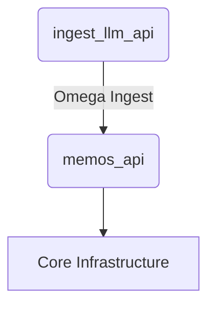

# 🌐 ApexSigma Docker Network Topology - TARGET STATE FOR MONOREPO

Proposal Date: September 13, 2025

Target Network Status: OPERATIONAL

Security Level: PROTECTED - Single Source of Truth

Primary Architect: Gemini

---

## ⚡ Network Configuration

### Primary Network

*   **Network Name**: `apexsigma_net`
*   **Network Type**: Bridge Network
*   **Subnet**: `172.26.0.0/16`
*   **Gateway**: `172.26.0.1`
*   **DNS Resolution**: Container name-based service discovery

---

## 🏗️ CORE INFRASTRUCTURE SERVICES (No Changes)

*   **1. PostgreSQL Database (Main)**: `apexsigma_postgres` @ `172.26.0.2`
*   **2. Redis Cache**: `apexsigma_redis` @ `172.26.0.3`
*   **3. RabbitMQ Message Queue**: `apexsigma_rabbitmq` @ `172.26.0.4`
*   **4. Qdrant Vector Database**: `apexsigma_qdrant` @ `172.26.0.5`
*   **5. Neo4j Knowledge Graph**: `apexsigma_neo4j` @ `172.26.0.14`

---

## 📊 OBSERVABILITY STACK (No Changes)

*   **6. Jaeger Tracing**: `apexsigma_jaeger` @ `172.26.0.6`
*   **7. Prometheus Metrics**: `apexsigma_prometheus` @ `172.26.0.7`
*   **8. Promtail Log Collector**: `apexsigma_promtail` @ `172.26.0.8`
*   **9. Grafana Dashboard**: `apexsigma_grafana` @ `172.26.0.10`
*   **10. Loki Log Aggregation**: `apexsigma_loki` @ `172.26.0.11`

---

## 🚀 APPLICATION SERVICES (MONOREPO STRUCTURE)

### 11. memOS API (Memory Operations System)

*   **Container**: `memos_api`
*   **Image**: `apexsigmaservices/memos-api`
*   **Internal IP**: `172.26.0.13/16`
*   **Internal Port**: `8090`
*   **Status**: ✅ PLANNED HEALTHY
*   **Primary Use**: **OMEGA INGEST GUARDIAN**. Single source of truth for all memory and knowledge.

### 12. InGest-LLM API (Data Ingestion Service)

*   **Container**: `ingest_llm_api`
*   **Image**: `apexsigmaservices/ingest-llm-api`
*   **Internal IP**: `172.26.0.12/16`
*   **Internal Port**: `8000`
*   **Status**: ✅ PLANNED HEALTHY
*   **Primary Use**: Data ingestion, content processing, pipeline orchestration.

### 13. tools.as API (Tool Registry Service)

*   **Container**: `tools_api`
*   **Image**: `apexsigmaservices/tools-api`
*   **Internal IP**: `172.26.0.15/16` (New IP)
*   **Internal Port**: `8010`
*   **Status**: ✅ PLANNED HEALTHY
*   **Database Connection**: `tools_postgres` @ `172.26.0.9`
*   **Primary Use**: Agent tool discovery and registration.

### 14. devenviro.as API (Agent Orchestrator)

*   **Container**: `devenviro_api`
*   **Image**: `apexsigmaservices/devenviro-api`
*   **Internal IP**: `172.26.0.16/16` (New IP, replaces faulty listener)
*   **Internal Port**: `8020`
*   **Status**: ✅ PLANNED HEALTHY
*   **Primary Use**: Orchestrates the agent swarm, manages agent lifecycle and communication.

### 15. Tools PostgreSQL (Dedicated)

*   **Container**: `tools_postgres`
*   **Image**: `postgres:16-alpine`
*   **Internal IP**: `172.26.0.9/16`
*   **Status**: ✅ HEALTHY
*   **Primary Use**: Isolated tool management for `tools_api`.

---

## 🤖 AGENT LAYER (EXTERNAL TO DOCKER NETWORK)

This layer represents the clients and agents that interact with the application services.

### memos-mcp-client

*   **Location**: `agents/memos-mcp-client/`
*   **Type**: CLI Application / Development Tool
*   **Function**: Acts as the primary client for interacting with the `memos_api`.
*   **Dogfooding Protocol**: All PRs to the `memos_api` service must pass integration tests executed by this client, ensuring the primary consumer is never broken.

---

## 🔗 REVISED SERVICE INTERCONNECTIONS

### Dogfooding Feedback Loop

```mermaid
graph TD
    A[Developer @ VSCode] --> B{memos-mcp-client};
    B -->|API Calls| C(memos_api);
    C --> D[Core Infrastructure];

````

### Agent Orchestration Flow

``` mermaid
graph TD
    subgraph Agent Layer
        E[Agent Swarm]
    end
    subgraph Docker Network
        F(devenviro_api)
        G(RabbitMQ)
        H(tools_api)
        I(memos_api)
    end
    E <-->|Control Plane| F;
    F <-->|Task Queues| G;
    F -->|Tool Discovery| H;
    F -->|Memory Operations| I;

```

### Data Flow



*This document represents the **TARGET STATE** for the ApexSigma ecosystem post-restructure. It will become the new VERIFIED map upon successful implementation of the "Monorepo Genesis" task plan.*

``` 