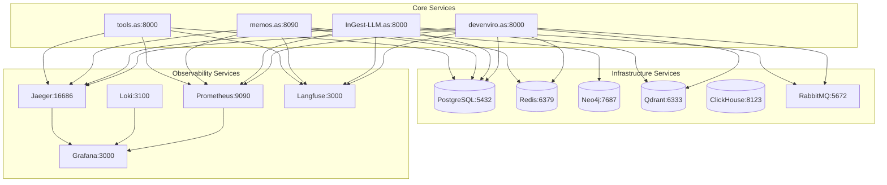

# ApexSigma Service Dependencies & API Endpoint Mapping

## Executive Summary

This document provides a comprehensive mapping of service dependencies, API endpoints, and communication patterns across the ApexSigma ecosystem. It serves as a reference for developers, architects, and operations teams to understand service interactions and troubleshoot issues.

---

## 1. Service Communication Matrix

### 1.1 Inter-Service Dependencies



### 1.2 Service-to-Service Communication

| Source Service | Target Service | Protocol | Port | Purpose | Frequency |
|----------------|----------------|----------|------|---------|-----------|
| devenviro.as | RabbitMQ | AMQP | 5672 | Agent orchestration | Real-time |
| devenviro.as | PostgreSQL | TCP | 5432 | Agent state storage | High |
| devenviro.as | Redis | TCP | 6379 | Session/cache management | High |
| devenviro.as | Qdrant | HTTP | 6333 | Vector embeddings | Medium |
| InGest-LLM.as | RabbitMQ | AMQP | 5672 | Content processing | Real-time |
| InGest-LLM.as | PostgreSQL | TCP | 5432 | Content metadata | High |
| InGest-LLM.as | Qdrant | HTTP | 6333 | Vector storage | High |
| memos.as | PostgreSQL | TCP | 5432 | Knowledge storage | High |
| memos.as | Neo4j | Bolt | 7687 | Relationship data | Medium |
| memos.as | Redis | TCP | 6379 | Session management | High |
| tools.as | PostgreSQL | TCP | 5432 | Tool metadata | Medium |

---

## 2. API Endpoint Mapping

### 2.1 DevEnviro.as (Agent Orchestration) - Port 8000

**Base URL:** `http://localhost:8000`

#### Agent Management Endpoints
```
GET  /api/v1/agents                    # List all agents
GET  /api/v1/agents/{agent_id}         # Get specific agent
POST /api/v1/agents                    # Create new agent
PUT  /api/v1/agents/{agent_id}         # Update agent
DELETE /api/v1/agents/{agent_id}       # Delete agent
```

#### Agent Orchestration Endpoints
```
POST /api/v1/orchestrate               # Start agent orchestration
GET  /api/v1/orchestrate/{task_id}     # Get orchestration status
POST /api/v1/orchestrate/{task_id}/cancel # Cancel orchestration
```

#### A2A (Agent-to-Agent) Communication
```
POST /api/v1/a2a/bridge                # Bridge to external agents
GET  /api/v1/a2a/status                # A2A bridge status
```

#### Health and Monitoring
```
GET  /health                           # Service health check
GET  /metrics                          # Prometheus metrics
GET  /openapi.json                     # API documentation
```

### 2.2 InGest-LLM.as (Content Ingestion) - Port 8000

**Base URL:** `http://localhost:8000`

#### Content Ingestion Endpoints
```
POST /api/v1/ingest                    # Ingest content
GET  /api/v1/ingest/{ingestion_id}     # Get ingestion status
POST /api/v1/ingest/batch              # Batch content ingestion
```

#### Repository Analysis
```
POST /api/v1/analyze/repository        # Analyze code repository
GET  /api/v1/analyze/{analysis_id}     # Get analysis results
POST /api/v1/analyze/documentation     # Generate documentation
```

#### Vector Operations
```
POST /api/v1/vectorize                 # Create vector embeddings
POST /api/v1/search/semantic           # Semantic search
GET  /api/v1/vectors/{vector_id}       # Get vector information
```

#### LLM Integration
```
POST /api/v1/llm/summarize             # Summarize content
POST /api/v1/llm/analyze               # Analyze content with LLM
POST /api/v1/llm/extract               # Extract information
```

### 2.3 Memos.as (Knowledge Management) - Port 8090

**Base URL:** `http://localhost:8090`

#### Knowledge Storage
```
POST /api/v1/memories                  # Store knowledge
GET  /api/v1/memories                  # List memories
GET  /api/v1/memories/{memory_id}      # Get specific memory
PUT  /api/v1/memories/{memory_id}      # Update memory
DELETE /api/v1/memories/{memory_id}    # Delete memory
```

#### Session Management
```
POST /api/v1/sessions                  # Create session
GET  /api/v1/sessions/{session_id}     # Get session
PUT  /api/v1/sessions/{session_id}     # Update session
DELETE /api/v1/sessions/{session_id}   # End session
```

#### Search and Retrieval
```
GET  /api/v1/search                    # Search memories
POST /api/v1/search/advanced           # Advanced search
GET  /api/v1/search/suggestions        # Search suggestions
```

#### Progress Tracking
```
POST /api/v1/progress                  # Log progress
GET  /api/v1/progress/{task_id}        # Get progress
GET  /api/v1/progress/summary          # Progress summary
```

### 2.4 Tools.as (Development Utilities) - Port 8000

**Base URL:** `http://localhost:8000`

#### Tool Registry
```
GET  /api/v1/tools                     # List available tools
POST /api/v1/tools                     # Register new tool
GET  /api/v1/tools/{tool_id}           # Get tool details
PUT  /api/v1/tools/{tool_id}           # Update tool
```

#### Tool Execution
```
POST /api/v1/tools/{tool_id}/execute   # Execute tool
GET  /api/v1/executions/{execution_id} # Get execution status
```

#### Cross-Service Integration
```
POST /api/v1/integrations              # Create integration
GET  /api/v1/integrations              # List integrations
DELETE /api/v1/integrations/{id}       # Remove integration
```

---

## 3. Message Queue Patterns

### 3.1 RabbitMQ Exchange Structure

**Exchanges:**
```
apexsigma.direct      # Direct routing for specific services
apexsigma.topic       # Topic-based routing for event types
apexsigma.fanout      # Fanout for broadcast messages
```

**Key Routing Keys:**
```
agent.orchestrate     # Agent orchestration requests
ingest.content        # Content ingestion events
memos.store           # Knowledge storage requests
tools.execute         # Tool execution requests
```

### 3.2 Message Flow Patterns

#### Agent Orchestration Flow
```
Producer: devenviro.as
Exchange: apexsigma.topic
Routing Key: agent.orchestrate.*
Consumers: All agent services
```

#### Content Processing Flow
```
Producer: InGest-LLM.as
Exchange: apesxigma.direct
Routing Key: ingest.content
Consumers: memos.as, devenviro.as
```

#### Knowledge Storage Flow
```
Producer: Any service
Exchange: apesxigma.topic
Routing Key: memos.store.*
Consumer: memos.as
```

---

## 4. Database Access Patterns

### 4.1 PostgreSQL Schema Distribution

**devenviro.as Schema:**
```sql
-- Agent definitions and configurations
agents (id, name, type, config, status, created_at, updated_at)
agent_sessions (id, agent_id, session_data, status, created_at)

-- Orchestration tasks
tasks (id, task_type, payload, status, agent_id, created_at, updated_at)
task_results (id, task_id, result_data, created_at)
```

**InGest-LLM.as Schema:**
```sql
-- Content ingestion tracking
ingestions (id, source_type, source_url, status, metadata, created_at)
content_items (id, ingestion_id, content_hash, content_type, size, created_at)

-- Vector embeddings
embeddings (id, content_id, vector_id, model_used, created_at)
```

**memos.as Schema:**
```sql
-- Knowledge storage
memories (id, title, content, tags, metadata, created_at, updated_at)
memory_relationships (id, from_memory_id, to_memory_id, relationship_type, strength)

-- Session management
user_sessions (id, user_id, session_data, expires_at, created_at)
```

**tools.as Schema:**
```sql
-- Tool registry
tools (id, name, description, category, config_schema, created_at, updated_at)
tool_executions (id, tool_id, parameters, result, status, created_at, completed_at)
```

### 4.2 NoSQL Database Usage

**Redis Key Patterns:**
```
session:{session_id}           # User session data
cache:{entity_type}:{id}       # Entity caching
rate_limit:{user_id}:{action}  # Rate limiting
temp:{operation}:{id}          # Temporary data
```

**Neo4j Graph Patterns:**
```cypher
// Agent relationships
CREATE (agent:Agent {name: $agentName, type: $agentType})
CREATE (task:Task {id: $taskId, type: $taskType})
CREATE (agent)-[:PERFORMS]->(task)

// Knowledge relationships
CREATE (memory:Memory {id: $memoryId, title: $title})
CREATE (concept:Concept {name: $conceptName})
CREATE (memory)-[:CONTAINS]->(concept)
```

**Qdrant Collection Structure:**
```json
{
  "name": "content_embeddings",
  "vectors": {
    "size": 768,
    "distance": "Cosine"
  },
  "payload_schema": {
    "content_id": "keyword",
    "content_type": "keyword",
    "source_service": "keyword"
  }
}
```

---

## 5. External Service Integrations

### 5.1 Langfuse (AI Observability)

**Integration Points:**
```python
# All services integrate with Langfuse for AI tracing
from langfuse import Langfuse

langfuse = Langfuse(
    public_key=settings.LANGFUSE_PUBLIC_KEY,
    secret_key=settings.LANGFUSE_SECRET_KEY,
    host=settings.LANGFUSE_HOST
)
```

**Traced Operations:**
- LLM API calls and responses
- Agent decision-making processes
- Content processing pipelines
- Knowledge retrieval operations

### 5.2 OpenAI Integration

**Service Usage:**
- **InGest-LLM.as:** Content analysis and summarization
- **devenviro.as:** Agent reasoning and planning
- **memos.as:** Knowledge extraction and organization

**Configuration:**
```python
import openai
openai.api_key = settings.OPENAI_API_KEY
```

### 5.3 Prometheus Metrics

**Metric Collection:**
```python
from prometheus_client import Counter, Histogram, Gauge

# Custom metrics defined across services
request_count = Counter('api_requests_total', 'Total API requests')
request_duration = Histogram('api_request_duration_seconds', 'API request duration')
active_connections = Gauge('active_connections', 'Number of active connections')
```

**Scraping Configuration:**
```yaml
# Prometheus configuration
scrape_configs:
  - job_name: 'apexsigma-services'
    static_configs:
      - targets: 
        - 'devenviro.as:8000'
        - 'ingest-llm.as:8000'
        - 'memos.as:8090'
        - 'tools.as:8000'
```

---

## 6. Health Check and Monitoring Endpoints

### 6.1 Service Health Checks

**Standard Health Check Pattern:**
```
GET /health
Response: {
  "status": "healthy",
  "timestamp": "2025-10-01T12:00:00Z",
  "version": "0.1.0",
  "dependencies": {
    "database": "healthy",
    "redis": "healthy",
    "message_queue": "healthy"
  }
}
```

**Detailed Health Check:**
```
GET /health/detailed
Response: {
  "status": "healthy",
  "checks": {
    "database": {"status": "healthy", "latency_ms": 15},
    "redis": {"status": "healthy", "latency_ms": 5},
    "external_services": {"status": "healthy", "details": {...}}
  }
}
```

### 6.2 Docker Health Checks

**Container Health Configuration:**
```yaml
healthcheck:
  test: ["CMD", "curl", "-f", "http://localhost:8000/health"]
  interval: 30s
  timeout: 10s
  retries: 3
  start_period: 40s
```

---

## 7. Error Handling and Retry Patterns

### 7.1 API Error Response Format

**Standard Error Response:**
```json
{
  "error": {
    "code": "RESOURCE_NOT_FOUND",
    "message": "The requested agent was not found",
    "details": {
      "agent_id": "agent_123",
      "timestamp": "2025-10-01T12:00:00Z"
    }
  }
}
```

### 7.2 Retry Configuration

**Exponential Backoff:**
```python
import asyncio
from tenacity import retry, stop_after_attempt, wait_exponential

@retry(
    stop=stop_after_attempt(3),
    wait=wait_exponential(multiplier=1, min=4, max=10)
)
async def call_external_service():
    # Service call with automatic retry
    pass
```

---

## 8. Rate Limiting and Throttling

### 8.1 Rate Limit Configuration

**Redis-based Rate Limiting:**
```python
import redis
import time

redis_client = redis.Redis(host='apexsigma_redis', port=6379)

def check_rate_limit(user_id: str, action: str, limit: int, window: int) -> bool:
    key = f"rate_limit:{user_id}:{action}"
    current = redis_client.incr(key)
    if current == 1:
        redis_client.expire(key, window)
    return current <= limit
```

### 8.2 Service-specific Limits

| Service | Endpoint | Rate Limit | Window |
|---------|----------|------------|---------|
| devenviro.as | /api/v1/orchestrate | 100/min | 60s |
| InGest-LLM.as | /api/v1/ingest | 50/min | 60s |
| memos.as | /api/v1/memories | 200/min | 60s |
| tools.as | /api/v1/tools/*/execute | 30/min | 60s |

---

## 9. Configuration Management

### 9.1 Environment Variables

**Core Configuration:**
```bash
# Database Configuration
POSTGRES_HOST=apexsigma_postgres
POSTGRES_PORT=5432
POSTGRES_DB=apexsigma_db
POSTGRES_USER=apexsigma_user
POSTGRES_PASSWORD=your_secure_password

# Redis Configuration
REDIS_HOST=apexsigma_redis
REDIS_PORT=6379

# Service URLs
DEVENVIRO_API_URL=http://devenviro.as:8000
INGEST_LLM_API_URL=http://ingest-llm.as:8000
MEMOS_API_URL=http://memos.as:8090
TOOLS_API_URL=http://tools.as:8000
```

### 9.2 Service Discovery

**Internal Service Discovery:**
```python
# Using Docker DNS for service resolution
SERVICES = {
    'devenviro': 'http://devenviro.as:8000',
    'ingest_llm': 'http://ingest-llm.as:8000',
    'memos': 'http://memos.as:8090',
    'tools': 'http://tools.as:8000'
}
```

---

## 10. Troubleshooting Service Communication

### 10.1 Common Issues and Solutions

**Service Connection Failures:**
```bash
# Check service health
curl -f http://localhost:8000/health  # devenviro.as
curl -f http://localhost:8000/health  # InGest-LLM.as
curl -f http://localhost:8090/health  # memos.as
curl -f http://localhost:8000/health  # tools.as
```

**Database Connection Issues:**
```bash
# Test database connectivity
docker exec apexsigma_postgres pg_isready -U apexsigma_user
docker exec apexsigma_redis redis-cli ping
docker exec apexsigma_neo4j cypher-shell -u neo4j -p password 'RETURN 1'
```

**Message Queue Issues:**
```bash
# Check RabbitMQ status
docker exec apexsigma_rabbitmq rabbitmq-diagnostics ping
# View queue status
docker exec apexsigma_rabbitmq rabbitmqctl list_queues
```

### 10.2 Debugging Tools

**Network Connectivity:**
```bash
# Test inter-service connectivity
docker exec devenviro.as wget -qO- http://ingest-llm.as:8000/health
docker exec ingest-llm.as wget -qO- http://memos.as:8090/health
```

**Log Analysis:**
```bash
# View service logs
docker-compose logs -f devenviro.as
docker-compose logs -f ingest-llm.as
docker-compose logs -f memos.as
docker-compose logs -f tools.as
```

---

This comprehensive mapping provides the foundation for understanding service interactions, debugging issues, and planning architectural improvements across the ApexSigma ecosystem.