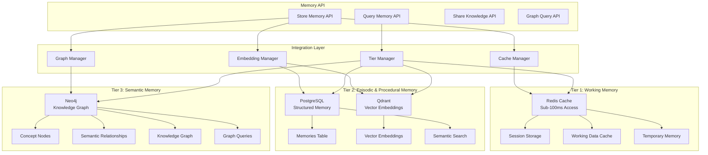
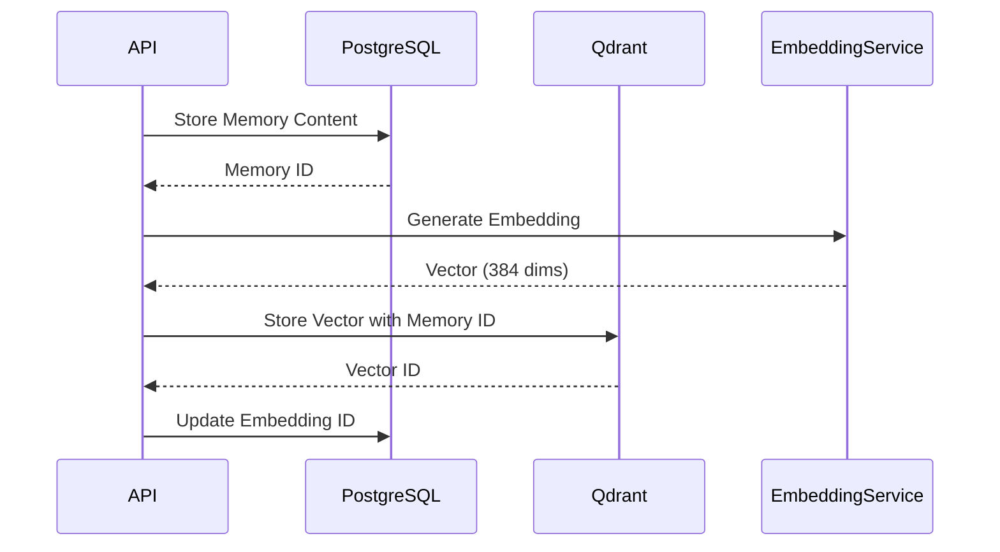
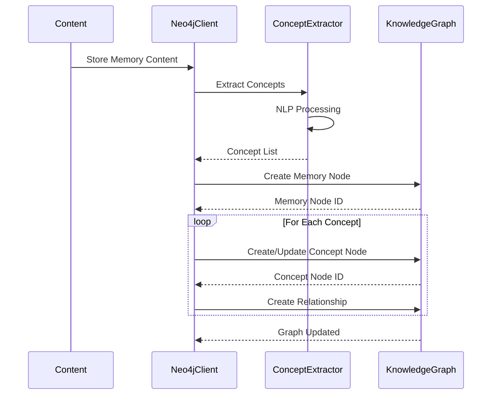
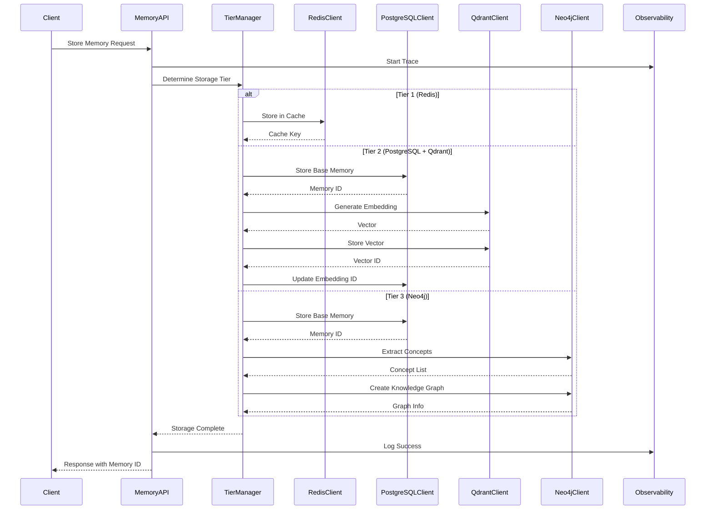
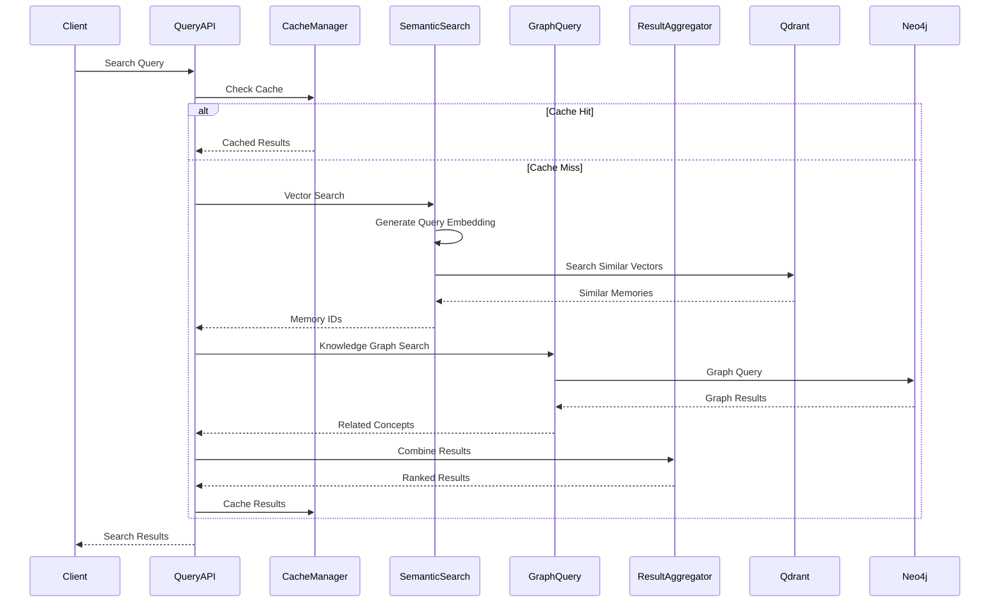
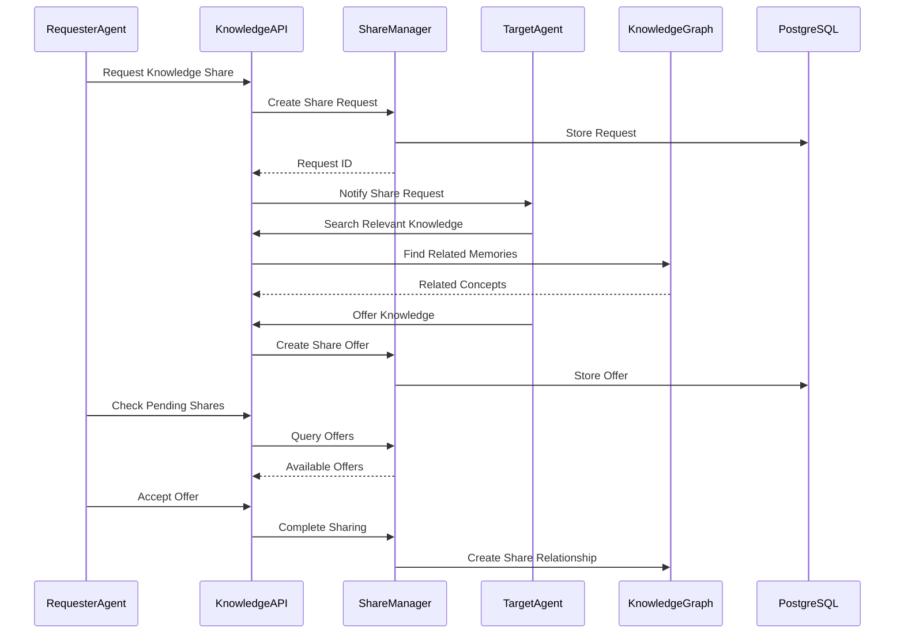
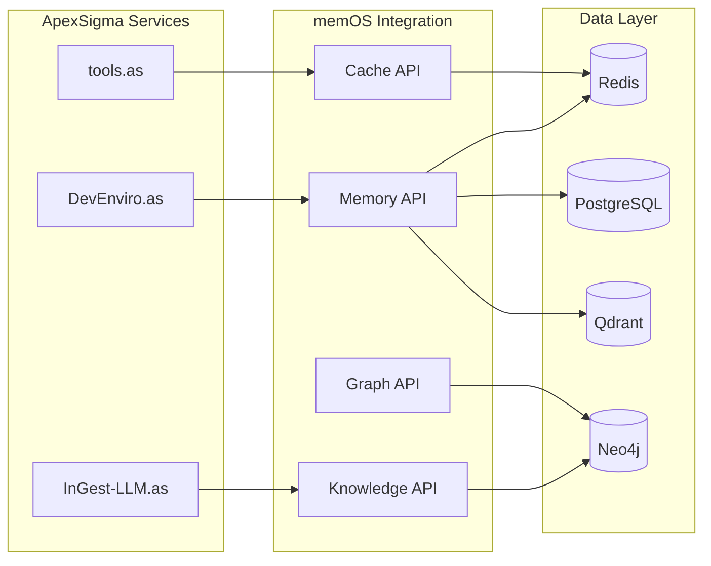

# memOS.as - Memory & Knowledge Management Architecture

## Overview

memOS.as implements a sophisticated three-tier memory architecture that provides persistent, semantic, and contextual memory storage for the ApexSigma ecosystem. The service combines traditional relational storage with vector embeddings and knowledge graphs to create a comprehensive memory management system that supports semantic search, knowledge sharing, and intelligent caching.

## Three-Tier Memory Architecture

### Architecture Overview



## Tier 1: Working Memory (Redis)

### Implementation Architecture

**Redis Client Implementation**:
```python
class RedisClient:
    """
    Redis client for Tier 1 working memory and caching.
    
    Handles:
    - Session management
    - Temporary data storage
    - Cache invalidation
    - Embedding caching
    - Query result caching
    """
    
    def __init__(self):
        self.host = os.environ.get("REDIS_HOST", "localhost")
        self.port = int(os.environ.get("REDIS_PORT", 6379))
        self.client = redis.Redis(host=self.host, port=self.port, decode_responses=True)
```

**Key Features**:
- **Sub-100ms access times** for cached data
- **Automatic expiration** with TTL management
- **Cache invalidation** strategies for data consistency
- **Session management** for user/agent sessions
- **Embedding caching** to avoid recomputation

### Cache Strategies

#### 1. Embedding Cache
```python
def cache_embedding(self, content: str, embedding: List[float]) -> bool:
    """Cache generated embeddings to avoid recomputation."""
    key = f"embedding:{hashlib.md5(content.encode()).hexdigest()}"
    return self.client.setex(key, 3600, json.dumps(embedding))
```

#### 2. Query Result Cache
```python
def cache_query_result(self, query: str, results: List[Dict], top_k: int) -> bool:
    """Cache semantic search results for frequently asked queries."""
    key = f"query:{hashlib.md5(query.encode()).hexdigest()}:{top_k}"
    return self.client.setex(key, 1800, json.dumps(results))
```

#### 3. Session Cache
```python
def store_session(self, session_id: str, data: Dict, expiry: int = 3600) -> bool:
    """Store session data with automatic expiry."""
    key = f"session:{session_id}"
    return self.client.setex(key, expiry, json.dumps(data))
```

## Tier 2: Episodic & Procedural Memory (PostgreSQL + Qdrant)

### PostgreSQL Implementation

**Database Schema**:
```sql
-- Core memory table
CREATE TABLE memories (
    id SERIAL PRIMARY KEY,
    content TEXT NOT NULL,
    tier VARCHAR(255) DEFAULT 'default',
    memory_metadata JSONB,
    embedding_id VARCHAR(255),
    created_at TIMESTAMP DEFAULT CURRENT_TIMESTAMP,
    updated_at TIMESTAMP DEFAULT CURRENT_TIMESTAMP,
    expires_at TIMESTAMP
);

-- Knowledge sharing tables
CREATE TABLE knowledge_share_requests (
    id SERIAL PRIMARY KEY,
    requester_agent_id VARCHAR(255) NOT NULL,
    target_agent_id VARCHAR(255) NOT NULL,
    query TEXT NOT NULL,
    confidence_threshold FLOAT NOT NULL,
    sharing_policy VARCHAR(50) NOT NULL,
    created_at TIMESTAMP DEFAULT CURRENT_TIMESTAMP
);

-- Tool registration table
CREATE TABLE registered_tools (
    id SERIAL PRIMARY KEY,
    name VARCHAR(255) UNIQUE NOT NULL,
    description TEXT,
    usage_instructions TEXT,
    tags TEXT[],
    created_at TIMESTAMP DEFAULT CURRENT_TIMESTAMP
);
```

**PostgreSQL Client Implementation**:
```python
class PostgresClient:
    """
    PostgreSQL client for Tier 2 structured memory storage.
    
    Manages:
    - Memory storage and retrieval
    - Knowledge sharing requests
    - Tool registration and discovery
    - Metadata management
    """
    
    def __init__(self):
        self.engine = create_engine(self.database_url)
        self.SessionLocal = sessionmaker(autocommit=False, autoflush=False, bind=self.engine)
```

### Qdrant Vector Storage Implementation

**Vector Collection Architecture**:
```python
class QdrantMemoryClient:
    """
    Qdrant client for vector embedding storage and semantic search.
    
    Handles:
    - Vector embedding generation and storage
    - Semantic similarity search
    - Vector similarity scoring
    - Multi-agent vector isolation
    """
    
    def __init__(self):
        self.collection_name = "memories"
        self.vector_size = 384  # Nomic embeddings size
        self.distance_metric = Distance.COSINE
```

**Vector Storage Process**:


**Semantic Search Implementation**:
```python
def search_similar_memories(self, query_embedding: List[float], 
                           top_k: int = 5, 
                           score_threshold: float = 0.7,
                           agent_id: Optional[str] = None) -> List[Dict]:
    """
    Perform semantic search using vector similarity.
    
    Args:
        query_embedding: Vector embedding of the search query
        top_k: Number of results to return
        score_threshold: Minimum similarity score
        agent_id: Optional agent filter
    
    Returns:
        List of similar memories with similarity scores
    """
    search_result = self.client.search(
        collection_name=self.collection_name,
        query_vector=query_embedding,
        limit=top_k,
        score_threshold=score_threshold,
        filter=models.Filter(
            must=[
                models.FieldCondition(
                    key="agent_id",
                    match=models.MatchValue(value=agent_id)
                ) if agent_id else None
            ]
        )
    )
    
    return [
        {
            "memory_id": hit.payload["memory_id"],
            "score": hit.score,
            "metadata": hit.payload.get("metadata", {})
        }
        for hit in search_result
    ]
```

## Tier 3: Semantic Memory (Neo4j)

### Knowledge Graph Architecture

**Neo4j Client Implementation**:
```python
class Neo4jClient:
    """
    Neo4j client for Tier 3 semantic memory and knowledge graph management.
    
    Manages:
    - Concept extraction from content
    - Knowledge graph construction
    - Semantic relationship mapping
    - Graph-based reasoning
    """
    
    def __init__(self):
        self.uri = os.environ.get("NEO4J_URI", "bolt://neo4j:7687")
        self.driver = GraphDatabase.driver(self.uri, auth=(self.username, self.password))
```

### Concept Extraction Process



### Graph Query Implementation

**Node Types**:
- **Memory**: Stored content with metadata
- **Concept**: Extracted concepts and entities
- **Tool**: Registered tools and capabilities
- **Agent**: Agent profiles and capabilities

**Relationship Types**:
- **CONTAINS**: Memory contains concept
- **RELATED_TO**: Concept relationships
- **USES_TOOL**: Agent uses tool
- **SHARES_KNOWLEDGE**: Knowledge sharing relationships

**Cypher Query Examples**:
```cypher
-- Find related concepts
MATCH (m:Memory {id: $memory_id})-[:CONTAINS]->(c:Concept)
MATCH (c)-[:RELATED_TO]->(related:Concept)
RETURN related, count(*) as strength
ORDER BY strength DESC
LIMIT 10

-- Find knowledge paths
MATCH path = shortestPath((start:Concept {name: $start_concept})-
                          [:RELATED_TO*]-(end:Concept {name: $end_concept}))
RETURN path, length(path) as path_length

-- Find agent capabilities
MATCH (agent:Agent {id: $agent_id})-[:USES_TOOL]->(tool:Tool)
RETURN tool.name, tool.description, tool.tags
```

## Memory Storage Process

### Complete Storage Flow



### Storage Optimization

**Intelligent Tier Selection**:
```python
def determine_storage_tier(self, content: str, metadata: Dict) -> str:
    """
    Determine optimal storage tier based on content and metadata.
    
    Decision Logic:
    - Tier 1: Temporary data, sessions, frequent access
    - Tier 2: Standard memories with semantic search needs
    - Tier 3: Complex knowledge requiring graph relationships
    """
    if metadata.get("temporary", False):
        return "1"
    elif metadata.get("complex_knowledge", False):
        return "3"
    elif len(content) < 1000 and metadata.get("frequent_access", False):
        return "1"
    else:
        return "2"
```

## Memory Query Process

### Multi-Tier Query Strategy



### Query Optimization

**Hybrid Search Strategy**:
```python
async def hybrid_search(self, query: str, top_k: int = 10) -> List[Dict]:
    """
    Perform hybrid search across all memory tiers.
    
    Combines:
    - Vector similarity search (semantic)
    - Graph relationship search (contextual)
    - Full-text search (keyword)
    - Cache lookup (performance)
    """
    # 1. Check cache first
    cached_results = await self.check_cache(query, top_k)
    if cached_results:
        return cached_results
    
    # 2. Generate query embedding
    query_embedding = await self.generate_embedding(query)
    
    # 3. Parallel search across tiers
    vector_results = await self.vector_search(query_embedding, top_k)
    graph_results = await self.graph_search(query)
    text_results = await self.text_search(query)
    
    # 4. Intelligent result ranking
    ranked_results = self.rank_results(
        vector_results, graph_results, text_results, query
    )
    
    # 5. Cache for future use
    await self.cache_results(query, ranked_results, top_k)
    
    return ranked_results
```

## Knowledge Sharing Architecture

### Knowledge Sharing Flow



### Sharing Policies

**Policy Types**:
- **open**: Share with any requesting agent
- **high_confidence_only**: Share only above confidence threshold
- **targeted**: Share only with specific agents
- **restricted**: No automatic sharing

**Confidence Scoring**:
```python
def calculate_sharing_confidence(self, memory: Dict, request: Dict) -> float:
    """
    Calculate confidence score for knowledge sharing.
    
    Factors:
    - Semantic similarity between request and memory
    - Agent relationship strength
    - Historical sharing success rate
    - Content relevance score
    """
    similarity_score = self.calculate_semantic_similarity(
        request["query"], memory["content"]
    )
    
    relationship_score = self.get_agent_relationship_score(
        request["requester_agent_id"], memory["agent_id"]
    )
    
    relevance_score = self.calculate_content_relevance(
        memory, request["context"]
    )
    
    confidence = (similarity_score * 0.4 + 
                 relationship_score * 0.3 + 
                 relevance_score * 0.3)
    
    return min(confidence, 1.0)
```

## Observability & Monitoring

### Memory Metrics

**Performance Metrics**:
- **Storage Latency**: Time to store memory across tiers
- **Query Latency**: Time to retrieve memories
- **Cache Hit Rate**: Redis cache effectiveness
- **Vector Search Accuracy**: Semantic search precision
- **Graph Query Performance**: Neo4j query execution time

**Usage Metrics**:
- **Memory Count**: Total memories per tier
- **Storage Distribution**: Memory distribution across tiers
- **Query Patterns**: Most common search queries
- **Knowledge Sharing**: Sharing frequency and success rate

### Health Monitoring

**Health Check Endpoints**:
```python
@app.get("/health")
async def health_check():
    """
    Comprehensive health check for all memory tiers.
    
    Returns health status for:
    - Redis connectivity and performance
    - PostgreSQL database status
    - Qdrant vector search availability
    - Neo4j graph database status
    """
    return {
        "service": "memOS.as",
        "status": "healthy",
        "tiers": {
            "redis": await self.check_redis_health(),
            "postgresql": await self.check_postgres_health(),
            "qdrant": await self.check_qdrant_health(),
            "neo4j": await self.check_neo4j_health()
        },
        "metrics": {
            "total_memories": await self.get_total_memory_count(),
            "cache_hit_rate": await self.get_cache_hit_rate(),
            "query_performance": await self.get_query_performance()
        }
    }
```

## Performance Characteristics

### Current Performance Metrics

**Storage Performance**:
- **Tier 1 (Redis)**: < 10ms write, < 5ms read
- **Tier 2 (PostgreSQL)**: < 50ms write, < 20ms read
- **Tier 2 (Qdrant)**: < 100ms embedding generation, < 50ms search
- **Tier 3 (Neo4j)**: < 200ms graph operations

**Query Performance**:
- **Cache Hit**: < 5ms response time
- **Vector Search**: < 100ms for top-k results
- **Graph Queries**: < 200ms for complex traversals
- **Hybrid Search**: < 300ms total response time

**Scalability Metrics**:
- **Concurrent Storage**: 1000+ operations/second
- **Concurrent Queries**: 500+ queries/second
- **Memory Capacity**: 10M+ memories per tier
- **Vector Capacity**: 1M+ embeddings

### Optimization Strategies

**Storage Optimization**:
- **Batch Operations**: Bulk insert for multiple memories
- **Async Processing**: Non-blocking storage operations
- **Compression**: Content compression for large memories
- **Index Optimization**: Database index tuning

**Query Optimization**:
- **Query Caching**: Result caching for frequent queries
- **Precomputation**: Pre-computed similarity matrices
- **Parallel Search**: Concurrent tier searching
- **Smart Routing**: Route queries to optimal tier

## Integration with ApexSigma Ecosystem

### Service Integration Patterns



### Cross-Service Memory Sharing

**Integration Benefits**:
- **Unified Memory**: Single source of truth across services
- **Semantic Search**: Cross-service knowledge discovery
- **Knowledge Graph**: Relationship mapping across domains
- **Performance Optimization**: Shared caching strategies

**Use Cases**:
- **Agent Memory**: Persistent agent context across sessions
- **Workflow Memory**: Workflow state and history tracking
- **Content Memory**: Ingested content with semantic indexing
- **Tool Memory**: Tool usage patterns and optimization

This three-tier memory architecture provides a robust foundation for intelligent memory management across the ApexSigma ecosystem, enabling sophisticated knowledge sharing, semantic search, and persistent context management for AI agents.