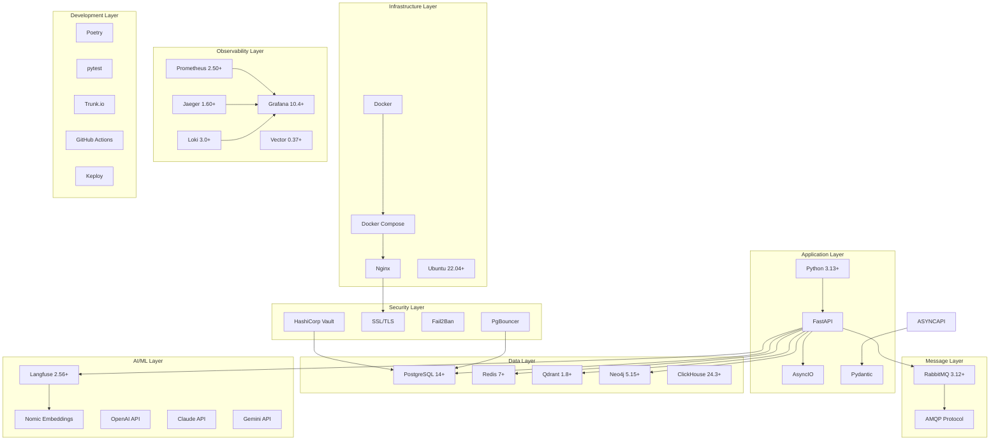
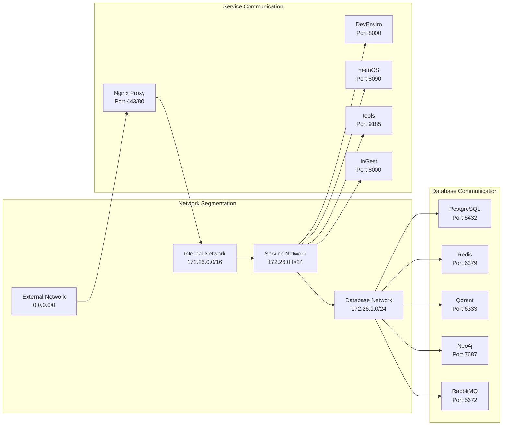
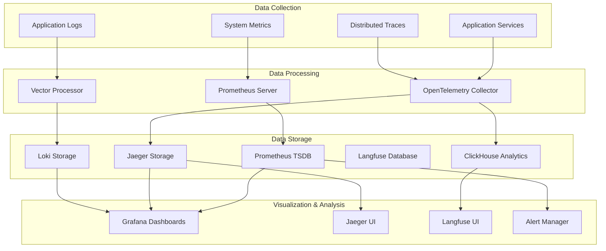
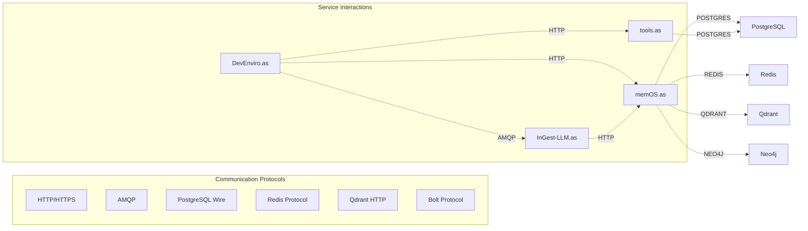

# ApexSigma Technology Stack & Component Analysis

## Executive Summary

The ApexSigma ecosystem employs a sophisticated multi-layered technology stack designed for enterprise-grade AI agent orchestration. This analysis provides a comprehensive overview of all technologies, frameworks, and components used across the system, along with their roles, interactions, and architectural significance.

## 🏗️ System-Wide Technology Stack

### Architecture Overview



## 📋 Technology Matrix by Service

### DevEnviro.as - Agent Orchestrator

| Component | Technology | Version | Purpose |
|-----------|------------|---------|---------|
| **Runtime** | Python | 3.13+ | Primary application runtime |
| **Web Framework** | FastAPI | 0.100+ | REST API development |
| **Async Runtime** | AsyncIO | Built-in | Concurrent operations |
| **Data Validation** | Pydantic | 2.0+ | Request/response validation |
| **Database ORM** | SQLAlchemy | 2.0+ | Database operations |
| **Message Queue** | RabbitMQ | 3.12+ | Agent communication |
| **Message Client** | aio-pika | 9.0+ | Async RabbitMQ client |
| **Observability** | Langfuse | 2.56+ | AI-native observability |
| **Monitoring** | prometheus-client | 0.16+ | Metrics collection |
| **Tracing** | OpenTelemetry | 1.24+ | Distributed tracing |
| **HTTP Client** | httpx | 0.24+ | Async HTTP requests |
| **Logging** | structlog | 23.1+ | Structured logging |
| **Environment** | python-dotenv | 1.0+ | Environment management |

### memOS.as - Memory Management

| Component | Technology | Version | Purpose |
|-----------|------------|---------|---------|
| **Runtime** | Python | 3.13+ | Primary application runtime |
| **Web Framework** | FastAPI | 0.100+ | REST API development |
| **Database** | PostgreSQL | 14+ | Structured memory storage |
| **Vector Database** | Qdrant | 1.8+ | Semantic search and embeddings |
| **Graph Database** | Neo4j | 5.15+ | Knowledge graph management |
| **Cache** | Redis | 7+ | Session and data caching |
| **Database Driver** | psycopg2-binary | 2.9+ | PostgreSQL client |
| **Neo4j Driver** | neo4j | 5.13+ | Graph database client |
| **Redis Client** | redis | 5.0+ | Cache operations |
| **Vector Client** | qdrant-client | 1.8+ | Vector operations |
| **Embeddings** | sentence-transformers | Latest | Text embeddings |
| **NLP Processing** | nltk | 3.8+ | Natural language processing |

### InGest-LLM.as - Content Ingestion

| Component | Technology | Version | Purpose |
|-----------|------------|---------|---------|
| **Runtime** | Python | 3.13+ | Primary application runtime |
| **Web Framework** | FastAPI | 0.100+ | REST API development |
| **Repository Analysis** | GitPython | 3.1+ | Git repository parsing |
| **Content Processing** | beautifulsoup4 | 4.12+ | HTML/XML parsing |
| **Markdown Processing** | markdown | 3.4+ | Markdown conversion |
| **Document Processing** | python-docx | 0.8+ | Word document processing |
| **PDF Processing** | PyPDF2 | 3.0+ | PDF text extraction |
| **LLM Integration** | openai | 1.0+ | OpenAI API integration |
| **Anthropic Integration** | anthropic | 0.7+ | Claude API integration |
| **Google Integration** | google-generativeai | 0.3+ | Gemini API integration |
| **Vector Processing** | numpy | 1.24+ | Numerical computations |
| **Text Processing** | transformers | 4.30+ | Hugging Face models |

### tools.as - Development Utilities

| Component | Technology | Version | Purpose |
|-----------|------------|---------|---------|
| **Runtime** | Python | 3.13+ | Primary application runtime |
| **Web Framework** | FastAPI | 0.100+ | REST API development |
| **Web Search** | google-search-results | 2.4+ | Serper API integration |
| **Database** | SQLAlchemy | 2.0+ | ORM for tool data |
| **SQLite** | sqlite3 | Built-in | Local tool storage |
| **HTTP Requests** | requests | 2.31+ | HTTP client |
| **Data Processing** | pandas | 2.0+ | Data manipulation |
| **Validation** | pydantic | 2.0+ | Data validation |
| **Async Operations** | asyncio | Built-in | Concurrent processing |

## 🏭 Infrastructure Technology Stack

### Container Orchestration

```yaml
# Docker Technologies
docker:
  version: "24.0+"
  compose_version: "3.8"
  networking: "bridge networks with custom subnets"
  volumes: "named volumes for data persistence"
  healthchecks: "built-in health monitoring"

# Container Base Images
base_images:
  python: "python:3.13-slim"
  postgres: "postgres:14-alpine"
  redis: "redis:7-alpine"
  qdrant: "qdrant/qdrant:v1.8.2"
  neo4j: "neo4j:5.15-community"
  clickhouse: "clickhouse/clickhouse-server:24.3-alpine"
  rabbitmq: "rabbitmq:3.12-management-alpine"
  nginx: "nginx:alpine"
```

### Network Architecture



## 🔒 Security Technology Stack

### Security Architecture

| Security Layer | Technology | Version | Purpose |
|----------------|------------|---------|---------|
| **SSL/TLS** | OpenSSL | 3.0+ | Encryption and certificates |
| **Reverse Proxy** | Nginx | 1.25+ | SSL termination and routing |
| **Secrets Management** | HashiCorp Vault | 1.15+ | Secret storage and access |
| **Threat Protection** | Fail2Ban | 1.0+ | Intrusion prevention |
| **Connection Pooling** | PgBouncer | 1.20+ | Database connection management |
| **Network Security** | Docker Networks | 24.0+ | Network segmentation |
| **Container Security** | Docker Security | 24.0+ | Container isolation |
| **API Security** | FastAPI Security | 0.100+ | Token-based authentication |

### Security Implementation

```python
# Security Configuration
security_config = {
    "ssl_tls": {
        "protocol": "TLS 1.3",
        "cipher_suites": "Modern encryption suites",
        "certificate_management": "Automated renewal"
    },
    "authentication": {
        "method": "Token-based",
        "token_lifetime": "24 hours",
        "refresh_mechanism": "Automatic renewal"
    },
    "authorization": {
        "model": "Role-based access control",
        "permissions": "Agent-specific capabilities"
    },
    "network_security": {
        "segmentation": "Docker network isolation",
        "firewall": "Container-level rules",
        "monitoring": "Network traffic analysis"
    }
}
```

## 📊 Observability Technology Stack

### Monitoring & Analytics

| Component | Technology | Version | Purpose |
|-----------|------------|---------|---------|
| **Metrics Collection** | Prometheus | 2.50+ | Time-series metrics |
| **Visualization** | Grafana | 10.4+ | Dashboards and charts |
| **Distributed Tracing** | Jaeger | 1.60+ | Request tracing |
| **Log Aggregation** | Loki | 3.0+ | Centralized logging |
| **Log Routing** | Vector | 0.37+ | Log processing and routing |
| **AI Observability** | Langfuse | 2.56+ | AI agent monitoring |
| **APM Integration** | OpenTelemetry | 1.24+ | Application performance monitoring |
| **Alerting** | Prometheus Alertmanager | 0.26+ | Alert management |

### Observability Architecture



## 🚀 Development & CI/CD Technology Stack

### Development Tools

| Tool Category | Technology | Version | Purpose |
|---------------|------------|---------|---------|
| **Dependency Management** | Poetry | 1.7+ | Python package management |
| **Code Quality** | Trunk.io | Latest | Code quality automation |
| **Testing Framework** | pytest | 8.4+ | Unit and integration testing |
| **Test Coverage** | pytest-cov | 4.0+ | Coverage reporting |
| **API Testing** | Keploy | Latest | API regression testing |
| **Code Formatting** | black | 23.0+ | Code formatting |
| **Type Checking** | mypy | 1.5+ | Static type checking |
| **Linting** | ruff | 0.1+ | Fast Python linter |
| **Security Scanning** | bandit | 1.7+ | Security vulnerability detection |

### CI/CD Pipeline

```yaml
# GitHub Actions Workflow
ci_cd_pipeline:
  triggers:
    - "Pull Request"
    - "Push to main/alpha"
    - "Daily scheduled runs"
  
  stages:
    - "Code Quality Checks"
    - "Dependency Installation"
    - "Unit Tests"
    - "Integration Tests"
    - "API Tests (Keploy)"
    - "Security Scans"
    - "Performance Tests"
    - "Deployment"
  
  tools:
    - "GitHub Actions for automation"
    - "Trunk.io for quality gates"
    - "pytest for testing"
    - "Keploy for API testing"
    - "Docker for containerization"
    - "Poetry for dependency management"
```

## 🔧 Infrastructure & DevOps Stack

### Container Technologies

```dockerfile
# Base Dockerfile Pattern
FROM python:3.13-slim

# Security updates
RUN apt-get update && apt-get upgrade -y && \
    apt-get install -y --no-install-recommends \
    curl \
    && rm -rf /var/lib/apt/lists/*

# Create non-root user
RUN useradd -m -u 1000 appuser
USER appuser

# Set working directory
WORKDIR /app

# Install Poetry
RUN pip install poetry

# Copy dependency files
COPY pyproject.toml poetry.lock ./

# Install dependencies
RUN poetry config virtualenvs.create false && \
    poetry install --no-dev

# Copy application code
COPY . .

# Health check
HEALTHCHECK --interval=30s --timeout=10s --start-period=40s --retries=3 \
  CMD curl -f http://localhost:8000/health || exit 1

# Run application
CMD ["poetry", "run", "uvicorn", "main:app", "--host", "0.0.0.0", "--port", "8000"]
```

### Orchestration Configuration

```yaml
# Docker Compose Services
docker_compose_config:
  version: "3.8"
  services:
    postgres:
      image: "postgres:14-alpine"
      environment:
        POSTGRES_DB: "apexsigma_db"
        POSTGRES_USER: "apexsigma_user"
        POSTGRES_PASSWORD: "Apexsigma123_"
      volumes:
        - "postgres_data:/var/lib/postgresql/data"
      healthcheck:
        test: ["CMD-SHELL", "pg_isready -U apexsigma_user -d apexsigma_db"]
        interval: 10s
        timeout: 5s
        retries: 5
      networks:
        - apexsigma_net
```

## 📈 Performance & Scalability Technologies

### Performance Optimization

| Optimization Area | Technology | Implementation |
|-------------------|------------|----------------|
| **Database Performance** | PgBouncer | Connection pooling |
| **Caching Strategy** | Redis | Multi-level caching |
| **Vector Search** | Qdrant | HNSW algorithm |
| **Async Processing** | AsyncIO | Non-blocking I/O |
| **Connection Management** | HTTPX | Connection pooling |
| **Memory Management** | Python GC | Garbage collection optimization |

### Scalability Features

```python
# Scalability Configuration
scalability_config = {
    "horizontal_scaling": {
        "container_orchestration": "Docker Compose",
        "load_balancing": "Nginx reverse proxy",
        "service_discovery": "Docker networking"
    },
    "vertical_scaling": {
        "resource_limits": "Container resource constraints",
        "memory_management": "Efficient data structures",
        "cpu_optimization": "Async processing"
    },
    "data_scaling": {
        "database_sharding": "Ready for implementation",
        "read_replicas": "PostgreSQL streaming replication",
        "cache_clustering": "Redis clustering"
    }
}
```

## 🔍 Technology Selection Rationale

### Why These Technologies?

#### Python 3.13+
- **Async Support**: Native asyncio for concurrent operations
- **Type Hints**: Enhanced type safety with mypy
- **Performance**: Continuous performance improvements
- **Ecosystem**: Rich library ecosystem for AI/ML

#### FastAPI
- **Performance**: One of the fastest Python web frameworks
- **Async Native**: Built-in async support
- **Automatic Documentation**: OpenAPI/Swagger generation
- **Type Safety**: Full Pydantic integration

#### PostgreSQL
- **ACID Compliance**: Strong consistency guarantees
- **JSON Support**: Native JSON/JSONB data types
- **Extensions**: Rich extension ecosystem
- **Performance**: Excellent query performance

#### Redis
- **Speed**: Sub-millisecond latency
- **Data Structures**: Rich data structure support
- **Persistence**: Configurable persistence options
- **Clustering**: Built-in clustering support

#### Qdrant
- **Vector Search**: Optimized for similarity search
- **Scalability**: Horizontal scaling capabilities
- **Performance**: HNSW algorithm for fast search
- **Filtering**: Metadata filtering support

#### Neo4j
- **Graph Native**: Built for graph operations
- **Cypher Query**: Powerful graph query language
- **Scalability**: Clustering and sharding support
- **Performance**: Optimized graph algorithms

#### RabbitMQ
- **Reliability**: Message persistence and delivery guarantees
- **Scalability**: Clustering and federation
- **Flexibility**: Multiple messaging patterns
- **Monitoring**: Built-in management interface

#### Langfuse
- **AI Native**: Designed for AI applications
- **Open Source**: Full source code availability
- **Integration**: Easy integration with existing systems
- **Analytics**: Rich analytics and insights

## 🎯 Technology Compatibility Matrix

### Version Compatibility

| Service | Python | FastAPI | Database | Message Queue | AI Integration |
|---------|--------|---------|----------|---------------|----------------|
| **DevEnviro.as** | 3.13+ | 0.100+ | PostgreSQL 14+ | RabbitMQ 3.12+ | Langfuse 2.56+ |
| **memOS.as** | 3.13+ | 0.100+ | PostgreSQL 14+ | N/A | Multiple LLMs |
| **InGest-LLM.as** | 3.13+ | 0.100+ | N/A | N/A | OpenAI, Claude, Gemini |
| **tools.as** | 3.13+ | 0.100+ | PostgreSQL 16+ | N/A | Serper API |

### Inter-Service Communication



## 🚀 Future Technology Roadmap

### Planned Enhancements

#### Performance Optimizations
- **Rust Integration**: Critical path optimization
- **Cython**: Performance-critical Python code
- **Redis Cluster**: Distributed caching
- **PostgreSQL Partitioning**: Large dataset optimization

#### AI/ML Enhancements
- **Custom Embeddings**: Domain-specific embedding models
- **Fine-tuned Models**: Specialized LLM models
- **Multi-modal Processing**: Image and audio processing
- **Real-time Learning**: Online model updates

#### Infrastructure Improvements
- **Kubernetes**: Container orchestration
- **Service Mesh**: Advanced service communication
- **Edge Computing**: Distributed processing
- **CDN Integration**: Global content delivery

#### Security Enhancements
- **Zero Trust Architecture**: Network security
- **End-to-end Encryption**: Data protection
- **Hardware Security Modules**: Key management
- **Advanced Threat Detection**: Security monitoring

This technology stack represents a carefully curated selection of enterprise-grade tools and frameworks that provide the foundation for building a scalable, secure, and performant AI agent ecosystem. The combination of modern Python web frameworks, specialized databases, comprehensive observability, and robust security measures creates a production-ready platform capable of supporting complex multi-agent workflows.